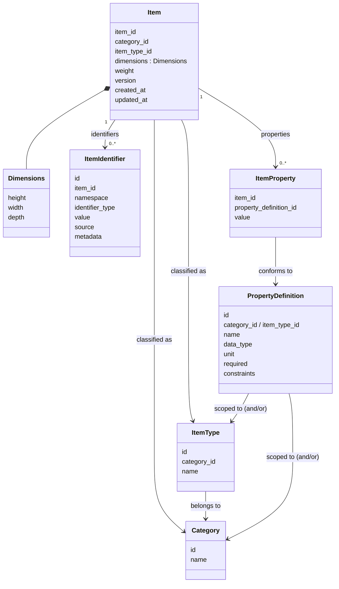

# 01 — Item Domain

> **Question this domain answers:** *"What is this thing?"*
> **Status:** Conceptual model established; persistence schema and API not finalized.

## Purpose

The Item Domain is the **single authoritative source for canonical item identity and canonical item description**.

It exists because every application currently holds its own representation of "an item", and there is no single record all of them can trust. The Item Domain gives every item one stable canonical identity (`item_id`), holds the facts that are *universally true* about the item regardless of which application is looking at it, and enforces the rules that keep those facts valid (classification rules, property rules, identifier rules, versioning).

Everything that is only true *inside one application's workflow* is explicitly excluded.

## Owns

The Item Domain is authoritative for:

| Concern | Detail |
|---|---|
| **Canonical identity** | The `item_id`. Stable, unique, never reused. See [02](02-canonical-identity-and-identifiers.md). |
| **External / business identifiers attached to an item** | Article number, SKU, Shopify product/variant ID, supplier article number, legacy IDs. Held as `ItemIdentifier` records that *point at* an item. See [02](02-canonical-identity-and-identifiers.md). |
| **Classification** | Which `Category` and `ItemType` the item belongs to. See [03](03-classification-and-properties.md). |
| **Physical description** | `dimensions` (height, width, depth) and `weight` are conceptually first-class attributes in the initial model. |
| **Classified properties** | Values for `PropertyDefinition`s that are legal for the item's classification (material, seat count, bulb type, …). See [03](03-classification-and-properties.md). |
| **Classification reference data** | `Category`, `ItemType`, `PropertyDefinition` — the vocabulary that determines what properties are legal. *Governance of this reference data is open (`OQ-CLS-02`).* |
| **Version and audit timestamps** | `version`, `created_at`, `updated_at` on the canonical entity. |
| **Its own persistence** | The Item database. No other component writes to it. |

## Does Not Own

This section is as important as the previous one.

| Not owned | Belongs to | Why |
|---|---|---|
| Workflow state (`awaiting_photography`, `in_review`, `ready_for_listing`, …) | The application that runs the workflow (Worker, Manager, …) | Not a property of the item; a property of a process acting on the item. |
| Listing state (`draft`, `published`, `archived_on_shopify`) | Seller app / integration workers | Describes a sales channel process, not the item. |
| Task / assignment / queue state | Applications | Process state. |
| UI state, selections, filters, "selected for campaign" | Applications | Process/UI state. |
| **Quantity on hand, stock levels** | [Inventory Domain](04-inventory-domain.md) | "How much and where" is a different question from "what". |
| **Where the item physically is** | [Inventory Domain](04-inventory-domain.md) via `location_id` | Same reason. The Item Domain has no `location` field. |
| Location definitions | [Location Domain](05-location-domain.md) | |
| Supplier / customer / dealer identity | [Party Domain](06-party-domain.md) | The Item Domain may *reference* a party (open, `OQ-PARTY-01`) but never defines one. |
| Prices, sales history, orders | Not assigned to any centralized domain in this architecture | Out of scope for the Item Domain; do not add here without a boundary decision. |
| Images / media | **Open** (`OQ-ITEM-08`) | Not stated in the brief; must not be assumed canonical. |
| Application-local projections of item data | Applications | Caches, not authorities. |

A useful test, applied to every candidate field:

> *"If every application were deleted tomorrow, would this fact still be true about the item?"*
> Dimensions: yes. Category: yes. `awaiting_photography`: no.

## Conceptual Model

This is a **conceptual** model. It is not a finalized schema; it names the concepts and their relationships.

### Item

| Field | Meaning | Status |
|---|---|---|
| `item_id` | Canonical identity. Opaque, stable, never reused. Example in brief: `itm_123`. | CONFIRMED (format open, `OQ-ID-07`) |
| `category_id` | Reference to `Category`. | PROPOSED — possibly redundant with `item_type.category_id` (`OQ-CLS-05`) |
| `item_type_id` | Reference to `ItemType`. | PROPOSED |
| `dimensions.height / width / depth` | Physical dimensions. Unit not specified. | PROPOSED (`OQ-ITEM-03`) |
| `weight` | Physical weight. Unit not specified. | PROPOSED (`OQ-ITEM-03`) |
| `identifiers[]` | The set of `ItemIdentifier` attached to this item. | CONFIRMED concept |
| `properties[]` | The set of `ItemProperty` attached to this item. | CONFIRMED concept |
| `version` | Monotonic version for optimistic concurrency. | CONFIRMED (what bumps it: `OQ-ITEM-05`) |
| `created_at`, `updated_at` | Audit timestamps. | PROPOSED |
| `name` | **Not in the conceptual model**, but referenced as canonical elsewhere in the brief and in the Worker projection example (`"name": "Stockholm Sofa"`). | **OPEN** (`OQ-ITEM-02`) |

### Aggregate boundary (proposed)

**PROPOSED:** `Item` is the aggregate root. `ItemIdentifier` and `ItemProperty` are owned by the item and are modified *through* the item, so that:

- a single command can be validated against the whole item state (e.g. "is this property legal for this item's type?");
- a single `version` can guard concurrent modification of the item and its identifiers/properties together.

Whether identifier/property changes increment `item.version` is **open** (`OQ-ITEM-05`), because the answer trades off contention against consistency.

`Category`, `ItemType` and `PropertyDefinition` are **reference data**, not part of the item aggregate. They are owned by the Item Domain but have their own lifecycle. See [03](03-classification-and-properties.md).

## Invariants

Full list with IDs in [11-invariants.md](11-invariants.md#item). Summary:

**Confirmed**

- `INV-ITEM-01` — A canonical `item_id` identifies exactly one item and is never reused.
- `INV-ITEM-02` — Application workflow state is never stored as canonical item state.
- `INV-ITEM-03` — Every change to canonical item state passes through the Item Domain's command boundary.
- `INV-ITEM-04` — Every item has a version; a committed change to the item increments it.
- `INV-ID-01` — External identifiers are never the canonical identity.
- `INV-CLS-01` — Properties assigned to an item must conform to the property definitions allowed for the item's classification.

**Proposed**

- `INV-ITEM-05` — `item_id` is immutable and carries no business meaning.
- `INV-ITEM-06` — An item's `item_type` must belong to the item's `category`.
- `INV-ITEM-07` — Identifier and property changes are changes to the item aggregate (and increment its version).

**Open**

- Whether an item may exist without classification (`OQ-ITEM-06`).
- Whether items can be deleted, retired or merged, and what "deletion" means for identifiers and references (`OQ-ITEM-04`).

## Commands / Operations

Commands are **conceptual**. Names, granularity and payloads are for the design session (`OQ-API-02`). Each command is subject to authorization (`OQ-AUTHZ-01`), validation, optimistic concurrency ([09](09-versioning-concurrency-and-idempotency.md)) and emits events ([08](08-commands-queries-and-events.md)).

| Command (conceptual) | Effect | Notes |
|---|---|---|
| `CreateItem` | Creates a new canonical item and assigns an `item_id`. | What is mandatory at creation is open (`OQ-ITEM-06`). May carry initial identifiers/properties. |
| `ClassifyItem` / `ChangeClassification` | Sets or changes `category_id` / `item_type_id`. | Effect on properties that become illegal is open (`OQ-CLS-03`). |
| `UpdateItemDimensions` / `UpdateItemWeight` (or a general `UpdateItem`) | Changes physical description. | Coarse vs fine-grained commands is open (`OQ-API-02`). |
| `SetItemProperty` / `RemoveItemProperty` | Sets or clears a value for a `PropertyDefinition`. | Validated against classification and definition constraints. |
| `AddItemIdentifier` | Attaches an external identifier. | Validated against uniqueness rules (open, `OQ-ID-01`). |
| `RemoveItemIdentifier` | Detaches an external identifier. | History retention open (`OQ-ID-06`). |
| Reference-data commands (`CreateCategory`, `CreateItemType`, `DefineProperty`, …) | Manage classification vocabulary. | Governance open (`OQ-CLS-02`). |
| Lifecycle commands (`RetireItem`, `MergeItems`, …) | **Not defined.** | Open (`OQ-ITEM-04`). |

**Not accepted, by design:**

- Any command that sets workflow state on an item.
- Any command that sets quantity or location on an item (that is Inventory).

## Queries

Consumers need, at minimum:

| Query (conceptual) | Who needs it |
|---|---|
| Get item by `item_id` (full canonical state incl. identifiers, properties, version) | All applications |
| **Resolve identifier → `item_id`** (`namespace`, `identifier_type`, `value`) | Scanner, integrations, every application during migration |
| List identifiers for an item | Integrations, Seller |
| Get classification reference data (categories, item types, property definitions for a type) | Manager, Worker (forms/validation), Seller |
| Search / filter items (by category, type, property, identifier prefix, …) | Manager, Seller — **capabilities open** (`OQ-API-04`) |
| Batch get by `item_id[]` | Projections, bulk views |

Whether applications should query the API synchronously on hot paths or rely on their projections is open (`OQ-APP-02`).

## Events

Initial event candidates from the brief (names are examples, not the final taxonomy — `OQ-EVT-01`):

| Event | Emitted when |
|---|---|
| `ItemCreated` | A new canonical item exists. |
| `ItemUpdated` | Physical description or other first-class attributes changed. |
| `ItemIdentifierAdded` | An identifier was attached. |
| `ItemIdentifierRemoved` | An identifier was detached. |
| `ItemClassificationChanged` | Category / item type changed. |
| `ItemPropertyChanged` | A property value was set, changed or removed. |

Every event carries the `item_id` and the resulting `version` so consumers can apply them idempotently and in order. Payload shape (delta vs snapshot) is open (`OQ-EVT-02`). See [08](08-commands-queries-and-events.md).

## Relationships

| Counterpart | Direction | Nature |
|---|---|---|
| **Inventory Domain** | Inventory → Item | Inventory references `item_id`. Item knows nothing about inventory. |
| **Location Domain** | none | Item does not reference locations. |
| **Party Domain** | Item → Party? | Not established. A supplier reference on an item *might* be wanted; today the brief only shows "supplier article number" as an *identifier*, not a party link. Open (`OQ-PARTY-01`). |
| **Applications** | App → Item (commands, queries); Item → App (events) | Applications hold `item_id` and projections. |
| **Shopify** | via integration workers | Shopify product/variant IDs are identifiers in the `shopify` namespace. Whether Shopify is a *source* of item facts, a *consumer*, or both is open (`OQ-MIG-04`). |

## Example Flow

### Flow A — A worker measures a sofa

1. The Worker app shows a task "measure item `itm_123`" (workflow state owned by Worker).
2. The worker enters 220 × 90 × 85 cm.
3. Worker app sends `UpdateItemDimensions { item_id: itm_123, expected_version: 17, dimensions: {…}, idempotency_key: … }` to the Item API.
4. Item Domain: authorizes the Worker app, validates the payload, checks `current_version == 17`, applies the change, sets `version = 18`, writes `ItemUpdated { item_id, version: 18, … }` to the outbox — all in one transaction.
5. Item API responds with `version: 18`.
6. Worker app advances *its own* workflow state to `awaiting_photography` in *its own* database. The Item Domain never learns about this.
7. Outbox publishes `ItemUpdated`. Seller app's projection updates the cached dimensions for `itm_123` to version 18.

### Flow B — Scanner resolves a barcode

1. Scanner reads a label carrying an article number `A-4932`.
2. Scanner app queries `ResolveIdentifier { namespace: "internal", identifier_type: "article_number", value: "A-4932" }` *(namespace/type names illustrative)*.
3. Item Domain returns `item_id: itm_123` (or "not found", or — depending on the still-open uniqueness rules — "ambiguous").
4. Scanner app proceeds with its own workflow using `itm_123`; it may then issue an *Inventory* command such as `place()` — not an Item command.

### Flow C — Creating an item with an initial classification (illustrative)

1. Manager app sends `CreateItem { category_id: furniture, item_type_id: sofa, properties: { material: "leather", seat_count: 3 }, identifiers: [{ namespace: "shopify", identifier_type: "variant_id", value: "482901284" }] }`.
2. Item Domain validates: item type belongs to category; `material` and `seat_count` are defined for Sofa; values match data types/constraints; required properties present (if enforced at creation — open); Shopify identifier does not violate uniqueness rules (open).
3. Item is created with `version: 1`; `ItemCreated` (and possibly finer-grained events) written to outbox.

## Failure / Conflict Cases

| Case | Expected behaviour |
|---|---|
| Update with `expected_version` ≠ current version | Rejected as a **version conflict**. Caller must re-read and decide. See [09](09-versioning-concurrency-and-idempotency.md). |
| Property not defined for the item's classification (e.g. `bulb_type` on a Sofa) | Rejected as a **validation error**. |
| Property value violates data type / constraints | Rejected as a **validation error**. |
| Identifier violates uniqueness rule | Rejected as a **conflict** — exact rule open (`OQ-ID-01`). |
| Item type does not belong to the given category | Rejected (proposed invariant `INV-ITEM-06`). |
| Attempt to set a workflow-like attribute (`status = awaiting_photography`) | There is no such command; the API must not offer a generic "set arbitrary attribute" escape hatch that would allow it. |
| Reclassification makes existing properties illegal | **Open** (`OQ-CLS-03`): reject, drop, or require the command to resolve them. |
| Retried command with the same idempotency key | Same result returned; no second change. See [09](09-versioning-concurrency-and-idempotency.md). |
| Unknown `item_id` | Not found. |

## Established Decisions

- The Item Domain answers *"what is this thing?"* and nothing else.
- It owns canonical item identity; every item has one stable `item_id`.
- External/business identifiers are attached to items and are never the canonical identity.
- It does **not** own application workflow state, quantity, or location.
- It owns its persistence; all writes go through its API.
- Properties are classification-driven and definition-based; there is no giant item table with every possible column.
- Canonical items carry a version and updates use optimistic concurrency.
- Canonical state changes are published as domain events via a transactional outbox.
- The conceptual model above is the starting point; the exact schema is *not* finalized.

## Open Questions

See [12-open-questions.md — Item](12-open-questions.md#item) for full detail. Headlines:

- `OQ-ITEM-01` — Item granularity: product/SKU definition vs unique physical unit vs both.
- `OQ-ITEM-02` — Is `name` (and description) a first-class canonical attribute?
- `OQ-ITEM-03` — Are dimensions/weight universal first-class attributes or classification-driven properties? Which units?
- `OQ-ITEM-04` — Item lifecycle: deletion, retirement, merging of duplicates; is there a *canonical* lifecycle status (distinct from workflow state)?
- `OQ-ITEM-05` — Aggregate/version boundary: do identifier and property changes bump `item.version`?
- `OQ-ITEM-06` — What is mandatory at creation; can an item exist unclassified?
- `OQ-ITEM-07` — Item-to-item relationships (variants, sets, components).
- `OQ-ITEM-08` — Are images/media canonical?
