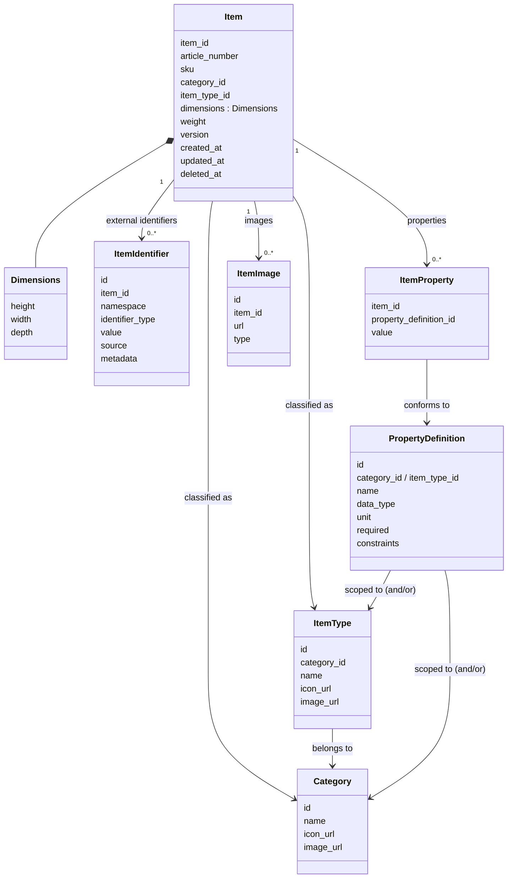

# 01 — Item Domain

> **Question this domain answers:** *"What is this thing?"*
> **Status:** Conceptual model established; persistence schema and API not finalized.

## Purpose

The Item Domain is the **single authoritative source for canonical item identity and canonical item description**.

It exists because every application currently holds its own representation of "an item", and there is no single record all of them can trust. The Item Domain gives every item one stable canonical identity (`item_id`), holds the facts that are *universally true* about the item regardless of which application is looking at it, and enforces the rules that keep those facts valid (classification rules, property rules, identifier rules, versioning).

Everything that is only true *inside one application's workflow* is explicitly excluded.

## Owns

The Item Domain is authoritative for:

| Concern | Detail |
|---|---|
| **Canonical surrogate identity** | The `item_id`. Stable, unique, never reused, minted by the domain. The identity applications store and reference. See [02](02-canonical-identity-and-identifiers.md). |
| **Canonical business identity** | `article_number` and `sku` — our own numbering schemes. First-class attributes of the Item, each independently unique. Values are supplied by the creating application or person; the domain enforces uniqueness and format. See [02](02-canonical-identity-and-identifiers.md). |
| **External identifiers attached to an item** | Shopify product/variant IDs, legacy system IDs, supplier article numbers, other foreign IDs. Held as `ItemIdentifier` records that *point at* an item. Not identity. See [02](02-canonical-identity-and-identifiers.md). |
| **Classification** | Which `Category` and `ItemType` the item belongs to. See [03](03-classification-and-properties.md). |
| **Physical description** | `dimensions` (height, width, depth) and `weight` are conceptually first-class attributes in the initial model. |
| **Visual representation** | The images that show what the item is, held as `ItemImage` link records: an absolute `url` plus a `type` naming the storage/source. Canonical — an image is a fact about what the thing looks like. The domain owns the *references*, not the image files. See *Images* below. |
| **Classified properties** | Values for `PropertyDefinition`s that are legal for the item's classification (material, seat count, bulb type, …). See [03](03-classification-and-properties.md). |
| **Classification reference data** | `Category`, `ItemType`, `PropertyDefinition` — the vocabulary that determines what properties are legal. *Governance of this reference data is open (`OQ-CLS-02`).* |
| **Version and audit timestamps** | `version`, `created_at`, `updated_at` on the canonical entity. |
| **Its own persistence** | The Item database. No other component writes to it. |

## Does Not Own

This section is as important as the previous one.

| Not owned | Belongs to | Why |
|---|---|---|
| Workflow state (`awaiting_photography`, `in_review`, `ready_for_listing`, …) | The application that runs the workflow (Worker, Manager, …) | Not a property of the item; a property of a process acting on the item. |
| Listing state (`draft`, `published`, `archived_on_shopify`) | Seller app / integration workers | Describes a sales channel process, not the item. |
| Task / assignment / queue state | Applications | Process state. |
| UI state, selections, filters, "selected for campaign" | Applications | Process/UI state. |
| **Quantity on hand, stock levels** | [Inventory Domain](04-inventory-domain.md) | "How much and where" is a different question from "what". |
| **Where the item physically is** | [Inventory Domain](04-inventory-domain.md) via `location_id` | Same reason. The Item Domain has no `location` field. |
| Location definitions | [Location Domain](05-location-domain.md) | |
| Supplier / customer / dealer identity | [Party Domain](06-party-domain.md) | The Item Domain may *reference* a party (open, `OQ-PARTY-01`) but never defines one. |
| Prices, sales history, orders | Not assigned to any centralized domain in this architecture | Out of scope for the Item Domain; do not add here without a boundary decision. |
| The image **files** themselves (hosting, storage, CDN, retention, deletion) | The application or third party that uploaded them | The Item Domain stores absolute URLs and a storage `type`; it never holds binaries. See `OQ-IMG-04`. |
| Workflow state about images ("awaiting photography", "needs retouching", "photo approved for listing") | Applications | The *photo* is canonical; the *process that produces and approves it* is not (`INV-IMG-06`). |
| Application-local projections of item data | Applications | Caches, not authorities. |

A useful test, applied to every candidate field:

> *"If every application were deleted tomorrow, would this fact still be true about the item?"*
> Dimensions: yes. Category: yes. `awaiting_photography`: no.

## Conceptual Model

This is a **conceptual** model. It is not a finalized schema; it names the concepts and their relationships.



### Item

| Field | Meaning | Status |
|---|---|---|
| `item_id` | Canonical surrogate identity. Opaque, stable, never reused. Example in brief: `itm_123`. | CONFIRMED (format open, `OQ-ID-07`) |
| `article_number` | Canonical business identity, assigned when the piece is **registered** at intake. Supplied, validated, unique. | CONFIRMED; required at creation (format `OQ-CID-03`, mutability `OQ-CID-04`) |
| `sku` | Canonical business identity, assigned when the restored piece is **published for sale**. Absent until then. | CONFIRMED; optional at creation |
| `category_id` | Reference to `Category`. | PROPOSED — possibly redundant with `item_type.category_id` (`OQ-CLS-05`) |
| `item_type_id` | Reference to `ItemType`. | PROPOSED |
| `dimensions.height / width / depth` | Physical dimensions. **Universal** canonical attribute — every object has them, whatever type it is. | CONFIRMED as first-class. Nullable at creation (measured after intake). **Units still open** (`OQ-ITEM-03`) |
| `weight` | Physical weight. Universal canonical attribute. | CONFIRMED as first-class. Nullable at creation. **Units still open** (`OQ-ITEM-03`) |
| `identifiers[]` | The set of **external** `ItemIdentifier` attached to this item. | CONFIRMED concept |
| `properties[]` | The set of `ItemProperty` attached to this item. | CONFIRMED concept |
| `images[]` | The set of `ItemImage` attached to this item. | CONFIRMED concept |
| `version` | Monotonic version for optimistic concurrency. | CONFIRMED (what bumps it: `OQ-ITEM-05`) |
| `created_at`, `updated_at` | Audit timestamps. | PROPOSED |
| `deleted_at` | Soft-delete marker. Every deletion is a soft delete; the record is retained. | CONFIRMED concept (exact representation is a schema choice) |

**An Item is a canonical business identity, not a count of physical units.**

> An Item is the canonical identity assigned by the business to **one or more** physical units that are currently treated as the same thing for identification purposes. The number of units represented by that identity is exclusively an Inventory concern.

So an Item may stand for one unique physical piece, or for sixty interchangeable ones. The business may purchase and register 60 identical chairs under **one** Item — one `item_id`, one `article_number`, eventually one `sku`. From inside the Item Domain those sixty chairs are simply *one canonical identity*: the domain does not represent the fact that there are sixty at all. That number lives in `InventoryPosition.quantity` and nowhere else.

| Domain | Question it answers |
|---|---|
| **Item** | *What canonical identity are these units represented as?* |
| **Inventory** | *How many units of that identity exist, and where are they?* |

**There is no invariant that one Item equals one physical unit** (`INV-ITEM-14`), and nothing in the model may assume one. Unique vintage furniture commonly produces one Item per physical piece — two visually similar vintage chairs will usually be registered as two items — but that is a **business usage pattern, not a domain rule**.

**The business decides, the domain records.** Identity grouping is a decision made when items are registered and managed. The Item Domain records and enforces the resulting identity; it never infers whether two physical units are similar enough to share one (`OQ-ITEM-12`).

**No relationships between Items.** An Item is an independent canonical row: no variants, no sets, no components, no parent/child items, no generic item-to-item links (`INV-ITEM-15`). Deciding to restore and sell four chairs as a set is a commercial act, not a persistent link between rows. Where item *identity* genuinely has to be grouped or split, that is separate business machinery — **marriage** and **divorce** — described below and **out of scope for this implementation** (`OQ-ITEM-07`).

**Splitting and grouping identity.** The business may later decide that units currently held under one identity should become separately identified. For example: Item A carries article number `CHAIR-001` and Inventory records quantity 60; later, four of those chairs are restored and sold as one separately identified group while the rest stay under the original identity. That can produce **new Item identities with their own `item_id`, `article_number` and potentially `sku`**. The inverse — grouping identities together — may exist too.

> **Do not design this yet.** How quantities move, how new identities are created, whether identifiers are inherited or regenerated, how history is represented, the transactional boundaries, and which domain or application owns the operation are all to be defined later. For this implementation, record only that the machinery exists conceptually, that it is out of scope, and that it **must not be pre-modelled** — no item-to-item relationships, parent/child links, sets or variants introduced in anticipation of it (`INV-ITEM-15`, `INV-ITEM-21`).

The Item model therefore carries **no product-definition or grouping semantics**: no "product with variants", no shared parent record.

The two business identifiers mark different points in that single piece's life:

| Identifier | Assigned when | Says |
|---|---|---|
| `article_number` | the piece is created / registered at intake | we have it and are tracking it |
| `sku` | the restored piece is published for sale | it is being offered |

> **Caution — `sku` is not a workflow flag.** It is *assigned at* a workflow milestone, but its presence is not a status. The Item Domain knows nothing about publishing: it has no `published` or `listed` state and must never gain one (`INV-ITEM-02`). An application must not read `sku IS NULL` as "not yet listed" — listing state belongs to the Seller application. At most, a missing `sku` says the piece has never been published, which is a historical fact rather than current status.

**Deliberately absent: `catalogue_id`.** Grouping similar pieces — potentially by similarity or vectorization over the properties that define them — is a **future concept and explicitly not part of this implementation**. It is named here so nobody reinvents it under another name, and so nothing is built now that approximates grouping. Adding it later is a nullable reference on the item plus a new entity; nothing in the current model needs to anticipate it. See `OQ-ITEM-11`.

**Deliberately absent: `name` and `description`.** Neither exists in this implementation. Classification, properties and images already describe what the thing is, and free text adds nothing the domain can validate or enforce — it is precisely the kind of field that drifts between applications while meaning nothing in particular.

A human recognises a piece from **its type, its image, and its article number or SKU** (`OQ-ITEM-09`). That is the whole presentation contract: identity is `article_number` / `sku`, what it is is classification plus properties, what it looks like is images.

If the business later needs something name-like — a model or range name such as "Stockholm" — its natural home is a `PropertyDefinition` scoped to the item types that actually have one, validated like any other property. That keeps naming classification-driven instead of a universal free-text column. See `OQ-ITEM-02` (resolved) and `OQ-ITEM-09`.

**Universal vs conditional.** `dimensions` and `weight` are first-class attributes of the Item because every physical object has them, whatever kind of thing it is. Properties are **conditional** attributes, meaningful only given the item's category and type — a seat count says nothing about a lamp. That is the test for any future candidate field: universal physical fact → first-class attribute; type-conditional fact → property (`OQ-ITEM-03`).

### Images

**ESTABLISHED:** an item's images are **canonical**. What the item looks like is a fact about the thing itself, not about any application's process, so it passes the same test as dimensions: if every application were deleted tomorrow, the sofa would still look like that.

```
ItemImage
    id
    item_id            ← the item this image depicts (link table)
    url                ← absolute URL
    type               ← storage / source designator, derived from the app that uploaded it
                          e.g. shopify, manager_app, worker_app
```

Two consequences worth stating explicitly:

- **The domain owns the reference, not the bytes.** Image files live in application-owned or third-party storage. The Item Domain records an absolute URL and never holds binaries. This keeps the domain simple, but it means a piece of canonical state depends on infrastructure the domain does not control: a retired bucket or a rotated CDN path silently breaks canonical data, and nothing in the current model detects it. `type` is what makes this tractable — it says whose storage a URL belongs to, so a broken reference can at least be attributed and potentially re-resolved. See `OQ-IMG-04`.
- **The photo is canonical; producing it is not.** "Awaiting photography", "needs retouching" and "photo approved for listing" are workflow states belonging to the Worker and Seller applications. The resulting image is canonical; the process is not (`INV-IMG-06`).

Deliberately **not** modelled for now — display order / primary image (`OQ-IMG-01`), role or purpose such as front/detail/damage (`OQ-IMG-02`), and alt text / captions (`OQ-IMG-03`).

### Aggregate boundary (proposed)

**CONFIRMED:** `Item` is the aggregate root. `ItemIdentifier`, `ItemProperty` and `ItemImage` are owned by the item and are modified *through* the item, so that:

- a single command can be validated against the whole item state (e.g. "is this property legal for this item's type?");
- a single `version` can guard concurrent modification of the item and its identifiers/properties together.

**Identifier, property and image changes all increment `item.version`** — that is what the version is for. It tracks the item's canonical state as a whole, so a change to any part of it is a change to the item (`OQ-ITEM-05` resolved, `INV-ITEM-07`).

The contention this creates is accepted deliberately: two applications editing different parts of the same item *will* conflict, and the alternative is silent divergence. In practice a Worker uploading eight photographs produces eight version bumps, any of which can invalidate a concurrent edit elsewhere, so applications need a re-read-and-retry path rather than a one-shot write. It also raises the stakes on command granularity (`OQ-API-02`): a coarse `UpdateItem` saving a whole form is one bump where fine-grained commands are many.

`Category`, `ItemType` and `PropertyDefinition` are **reference data**, not part of the item aggregate. They are owned by the Item Domain but have their own lifecycle. See [03](03-classification-and-properties.md).

## Invariants

Full list with IDs in [11-invariants.md](11-invariants.md#item). Summary:

**Confirmed**

- `INV-ITEM-01` — A canonical `item_id` identifies exactly one item and is never reused.
- `INV-ITEM-02` — Application workflow state is never stored as canonical item state.
- `INV-ITEM-03` — Every change to canonical item state passes through the Item Domain's command boundary.
- `INV-ITEM-04` — Every item has a version; a committed change to the item increments it.
- `INV-CID-01` — `article_number` and `sku` are canonical identity and are first-class attributes of the Item.
- `INV-CID-02` — Each of `article_number` and `sku` identifies at most one item.
- `INV-CID-03` — The domain enforces uniqueness and format on supplied business identifiers; it does not generate them.
- `INV-ID-01` — External identifiers are never the canonical identity.
- `INV-CLS-01` — Properties assigned to an item must conform to the property definitions allowed for the item's classification.

**Proposed**

- `INV-ITEM-05` — `item_id` is immutable and carries no business meaning.
- `INV-ITEM-06` — An item's `item_type` must belong to the item's `category`.
- `INV-ITEM-07` — Identifier and property changes are changes to the item aggregate (and increment its version).

**Open**

- Whether an item may exist without classification (`OQ-ITEM-06`).
- Whether items can be deleted, retired or merged, and what "deletion" means for identifiers and references (`OQ-ITEM-04`).

## Commands / Operations

Commands are **conceptual**. Names, granularity and payloads are for the design session (`OQ-API-02`). Each command is subject to authorization (`OQ-AUTHZ-01`), validation, optimistic concurrency ([09](09-versioning-concurrency-and-idempotency.md)) and emits events ([08](08-commands-queries-and-events.md)).

| Command (conceptual) | Effect | Notes |
|---|---|---|
| `CreateItem` | Registers one canonical identity: mints an `item_id` and carries the supplied `article_number`. | **Mandatory:** `article_number`, `category`, `item_type`, and all **required properties** for that classification — nothing else (`INV-ITEM-16`). `sku`, dimensions and weight are **not** supplied here; they arrive later. |
| `SetItemArticleNumber` / `SetItemSku` (or via `UpdateItem`) | Changes a canonical business identifier. | Only meaningful if mutable (`OQ-CID-04`). Re-validates uniqueness. |
| `ClassifyItem` / `ChangeClassification` | Sets or changes `category_id` / `item_type_id`. | Effect on properties that become illegal is open (`OQ-CLS-03`). |
| `UpdateItemDimensions` / `UpdateItemWeight` (or a general `UpdateItem`) | Changes physical description. | Coarse vs fine-grained commands is open (`OQ-API-02`). |
| `SetItemProperty` / `RemoveItemProperty` | Sets or clears a value for a `PropertyDefinition`. | Validated against classification and definition constraints. |
| `AddItemIdentifier` | Attaches an **external** identifier. | Validated against uniqueness rules (open, `OQ-ID-01`). Rejects canonical identities (`INV-ID-09`). |
| `RemoveItemIdentifier` | Detaches an external identifier. | History retention open (`OQ-ID-06`). |
| `AddItemImage` | Attaches an image (absolute `url` + storage `type`). | Ordering/primary not modelled yet (`OQ-IMG-01`). |
| `RemoveItemImage` | Detaches an image. | Whether the underlying file is deleted from storage is the uploading application's concern, not the domain's. |
| Reference-data commands (`CreateCategory`, `CreateItemType`, `DefineProperty`, …) | Manage classification vocabulary. | Governance open (`OQ-CLS-02`). |
| `DeleteItem` | Soft-deletes the item; the record is retained and flagged. | **CONFIRMED.** Does not consult Inventory (`INV-ITEM-13`). Visibility of deleted items in queries is open (`OQ-ITEM-10`). |
| ~~`RetireItem`~~, ~~`MergeItems`~~ | **These do not exist.** | Items are never retired or merged. If the business has more of a thing, that is a quantity fact in [Inventory](04-inventory-domain.md), not an operation on the item record. |

**Not accepted, by design:**

- Any command that sets workflow state on an item.
- Any command that sets quantity or location on an item (that is Inventory).

## Queries

Consumers need, at minimum:

| Query (conceptual) | Who needs it |
|---|---|
| Get item by `item_id` (full canonical state incl. identifiers, properties, version) | All applications |
| **Get item by `article_number` / by `sku`** — direct lookup on a canonical attribute | Scanner, Manager, Seller |
| **Resolve external identifier → `item_id`** (`namespace`, `identifier_type`, `value`) | Integrations, every application during migration |
| List external identifiers for an item | Integrations, Seller |
| Get classification reference data (categories, item types, property definitions for a type) | Manager, Worker (forms/validation), Seller |
| Search / filter items (by category, type, property, identifier prefix, …) | Manager, Seller — **capabilities open** (`OQ-API-04`) |
| Batch get by `item_id[]` | Projections, bulk views |

Whether applications should query the API synchronously on hot paths or rely on their projections is open (`OQ-APP-02`).

## Events

Initial event candidates from the brief (names are examples, not the final taxonomy — `OQ-EVT-01`):

| Event | Emitted when |
|---|---|
| `ItemCreated` | A new canonical item exists. |
| `ItemUpdated` | Physical description or other first-class attributes changed. |
| `ItemIdentifierAdded` | An identifier was attached. |
| `ItemIdentifierRemoved` | An identifier was detached. |
| `ItemClassificationChanged` | Category / item type changed. |
| `ItemPropertyChanged` | A property value was set, changed or removed. |
| `ItemDeleted` | The item was soft-deleted. **Proposed** name; the fact itself is confirmed. Consumers must decide whether to drop or flag the projection row (`OQ-ITEM-10`). |
| `ItemImageAdded` / `ItemImageRemoved` | An image was attached or detached. **Proposed** — not in the brief's initial list, but image changes are canonical state changes and consumers (Seller, Shopify) will need them. |

Every event carries the `item_id` and the resulting `version` so consumers can apply them idempotently and in order. Payload shape (delta vs snapshot) is open (`OQ-EVT-02`). See [08](08-commands-queries-and-events.md).

## Relationships

| Counterpart | Direction | Nature |
|---|---|---|
| **Inventory Domain** | Inventory → Item | Inventory references `item_id`. Item knows nothing about inventory. |
| **Location Domain** | none | Item does not reference locations. |
| **Party Domain** | Item → Party? | Not established. A supplier reference on an item *might* be wanted; today the brief only shows "supplier article number" as an *external identifier*, not a party link. Open (`OQ-PARTY-01`). |
| **Applications** | App → Item (commands, queries); Item → App (events) | Applications hold `item_id` and projections. |
| **Shopify** | via integration workers | Shopify product/variant IDs are identifiers in the `shopify` namespace. Whether Shopify is a *source* of item facts, a *consumer*, or both is open (`OQ-MIG-04`). |

## Example Flow

### Flow A — A worker measures a sofa

1. The Worker app shows a task "measure item `itm_123`" (workflow state owned by Worker).
2. The worker enters 220 × 90 × 85 cm.
3. Worker app sends `UpdateItemDimensions { item_id: itm_123, expected_version: 17, dimensions: {…}, idempotency_key: … }` to the Item API.
4. Item Domain: authorizes the Worker app, validates the payload, checks `current_version == 17`, applies the change, sets `version = 18`, writes `ItemUpdated { item_id, version: 18, … }` to the outbox — all in one transaction.
5. Item API responds with `version: 18`.
6. Worker app advances *its own* workflow state to `awaiting_photography` in *its own* database. The Item Domain never learns about this.
7. Outbox publishes `ItemUpdated`. Seller app's projection updates the cached dimensions for `itm_123` to version 18.

### Flow B — Scanner reads a label

1. Scanner reads a label carrying our article number `A-4932`.
2. Scanner app queries `GetItemByArticleNumber("A-4932")`.
3. Item Domain returns the item (`item_id: itm_123`), or "not found". It cannot be ambiguous: `article_number` is canonical identity and therefore unique (`INV-CID-02`).
4. Scanner app proceeds with its own workflow using `itm_123`; it may then issue an *Inventory* command such as `place()` — not an Item command.

Had the label carried a *foreign* code (a supplier's barcode, a legacy sticker), step 2 would instead be `ResolveExternalIdentifier(namespace, identifier_type, value)`, which *can* return "ambiguous" depending on `OQ-ID-01`.

### Flow C — Creating an item with an initial classification (illustrative)

1. Manager app sends `CreateItem { article_number: "A-4932", sku: "SOFA-STO-3L", category_id: furniture, item_type_id: sofa, properties: { material: "leather", seat_count: 3 }, identifiers: [{ namespace: "shopify", identifier_type: "variant_id", value: "482901284" }] }`.
2. Item Domain validates: `article_number` and `sku` are not already held by another item; item type belongs to category; `material` and `seat_count` are defined for Sofa; values match data types/constraints; required properties present (if enforced at creation — open); Shopify identifier does not violate uniqueness rules (open).
3. Item is created with `version: 1`; `ItemCreated` (and possibly finer-grained events) written to outbox.

## Failure / Conflict Cases

| Case | Expected behaviour |
|---|---|
| Update with `expected_version` ≠ current version | Rejected as a **version conflict**. Caller must re-read and decide. See [09](09-versioning-concurrency-and-idempotency.md). |
| Property not defined for the item's classification (e.g. `bulb_type` on a Sofa) | Rejected as a **validation error**. |
| Property value violates data type / constraints | Rejected as a **validation error**. |
| `article_number` or `sku` already held by another item | Rejected as a **conflict**. Uniqueness is what makes them identity (`INV-CID-02`). |
| External identifier violates uniqueness rule | Rejected as a **conflict** — exact rule open (`OQ-ID-01`). |
| Item type does not belong to the given category | Rejected (proposed invariant `INV-ITEM-06`). |
| `CreateItem` without a classification | Rejected — an item cannot exist unclassified (`INV-ITEM-09`). |
| `CreateItem` missing a required property for its classification | Rejected — required properties are enforced at creation (`INV-CLS-05`). |
| `DeleteItem` on an already-deleted item | Idempotent no-op (proposed). |
| `DeleteItem` while Inventory still holds stock | **Succeeds.** Item never reads Inventory state (`INV-ITEM-13`), so positions can outlive the item record. Reconciliation is a deliberate cost of the boundary (`OQ-ITEM-10`). |
| Attempt to set a workflow-like attribute (`status = awaiting_photography`) | There is no such command; the API must not offer a generic "set arbitrary attribute" escape hatch that would allow it. |
| Reclassification makes existing properties illegal | **Open** (`OQ-CLS-03`): reject, drop, or require the command to resolve them. |
| Retried command with the same idempotency key | Same result returned; no second change. See [09](09-versioning-concurrency-and-idempotency.md). |
| Unknown `item_id` | Not found. |

## Established Decisions

- The Item Domain answers *"what is this thing?"* and nothing else.
- It owns canonical item identity in three layers: the domain-minted surrogate `item_id`, the supplied-but-guaranteed business identities `article_number` and `sku`, and recorded external identifiers.
- `article_number` and `sku` are canonical identity — two distinct, independently unique, first-class attributes of the Item.
- External identifiers (Shopify IDs, legacy app IDs, supplier article numbers) are attached to items and are never the canonical identity.
- `item_id` remains the identity applications store and reference across systems.
- It does **not** own application workflow state, quantity, or location.
- It owns its persistence; all writes go through its API.
- Properties are classification-driven and definition-based; there is no giant item table with every possible column.
- **An Item is the canonical identity the business assigns to one or more physical units treated as the same thing for identification purposes.** There is **no invariant that one Item equals one physical unit**; multiple units may share one `item_id`, `article_number` and `sku`. One Item per unique vintage piece is a common usage pattern, not a domain rule.
- **Quantity never belongs to the Item Domain.** How many units exist under an identity is exclusively Inventory's concern.
- **Identity grouping is a business decision** made at registration/management. The domain records and enforces it; it never infers it.
- The business may later **split or group** identities via "marriage / divorce" machinery. Its semantics are undefined, out of scope, and must not be pre-modelled here.
- **Items have no relationships to other Items.** No variants, sets, components or parent/child links. Grouping or splitting identity is separate "marriage / divorce" machinery, out of scope here.
- The model carries no product-definition or grouping semantics; `catalogue_id` is a deferred future concept.
- `dimensions` and `weight` are **universal** first-class attributes; properties are **conditional** on category and type. Units are not yet specified.
- Identifier, property and image changes **all increment `item.version`**.
- Mandatory at creation: `article_number`, `category`, `item_type`, and required properties — nothing else.
- Soft deletion follows the industry standard: a deletion marker, excluded from queries by default, opt-in to include, restore possible.
- `article_number` is assigned at registration and is required at creation; `sku` is assigned when the restored piece is published for sale and is absent until then.
- An item **cannot exist without a classification**; category and item type are required at creation.
- Items **can be deleted, and every deletion is a soft delete** — the record is retained and flagged, never physically removed.
- There is **no retire and no merge**. Two item records are never fused; "more of this thing" is a quantity fact in the Inventory Domain.
- Deleting an item does **not** consult Inventory; the Item Domain never reads Inventory state.
- `article_number` and `sku` are permanently unique: a soft-deleted item keeps its values and they are never reused.
- Item images are canonical: an item's visual representation is part of its canonical description. They are held as `ItemImage` link records carrying an absolute `url` and a storage/source `type`. The domain owns the references, not the image files.
- `Category` and `ItemType` each carry an `icon_url` and an `image_url` so every application presents the vocabulary identically.
- Canonical items carry a version and updates use optimistic concurrency.
- Canonical state changes are published as domain events via a transactional outbox.
- The conceptual model above is the starting point; the exact schema is *not* finalized.

## Open Questions

See [12-open-questions.md — Item](12-open-questions.md#item) for full detail. Headlines:

- `OQ-ITEM-12` — What makes two physical things one Item identity rather than two. Now the central identity question.
- `OQ-ITEM-11` — `catalogue_id`: grouping similar pieces, a deferred future concept.
- `OQ-ITEM-03` — **Units** for dimensions and weight. (Their universality is resolved; the units are not.)
- `OQ-ITEM-10` — Residual soft-delete questions the industry standard does not cover: projection behaviour on delete, and who reconciles inventory left behind.
- `OQ-CID-03` / `OQ-CID-04` / `OQ-CID-05` — Business identifier format, mutability and value normalization. (`OQ-CID-01` and `OQ-CID-02` are **resolved**: `article_number` at registration and required, `sku` at publication and absent until then.) See [02](02-canonical-identity-and-identifiers.md#open-questions).
- `OQ-ITEM-09` — How an item is presented to a human, now that there is no `name`. (`OQ-ITEM-02` — whether `name` is canonical — is **resolved: it does not exist**.)
- `OQ-ITEM-03` — Are dimensions/weight universal first-class attributes or classification-driven properties? Which units?
- `OQ-ITEM-10` — Soft-delete semantics: query visibility, undelete, and who reconciles inventory left behind. (`OQ-ITEM-04` — deletion/retirement/merging — is **resolved**: soft delete only, no retire, no merge.)
- `OQ-ITEM-05` — Aggregate/version boundary: do identifier and property changes bump `item.version`?
- `OQ-ITEM-06` — **Resolved:** an item can never exist unclassified. What else is mandatory at creation remains split across `OQ-CID-02` (identifiers) and `OQ-PROP-03` (required properties).
- `OQ-ITEM-07` — Item-to-item relationships (variants, sets, components).
- `OQ-IMG-01` … `OQ-IMG-07` — Image ordering/primary, role, alt text, URL durability, `type` semantics, aggregate membership, and category/item-type asset fallbacks. (`OQ-ITEM-08` — *whether* images are canonical — is now **resolved: yes**.)
