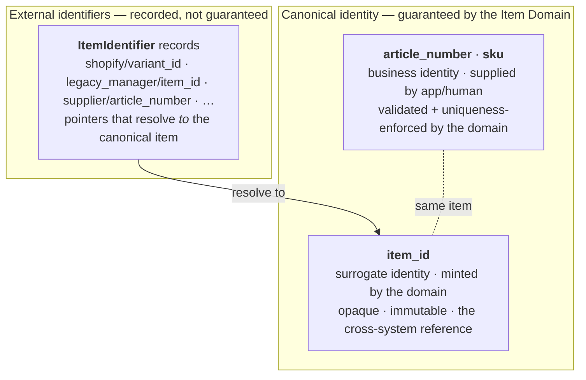

# 02 — Canonical Identity and Identifiers

> **Responsibility:** Provide the identities that name an item — those the Item Domain *guarantees*, and those it merely *records* — and let every existing identifier in the business resolve to the canonical item.
> **Status:** The three-layer identity model is **established**, and uniqueness is permanent. Format rules, mandatory-ness, mutability, value normalization and external-identifier lifecycle are **open**.

## Purpose

An item is known by many names: an article number, a SKU, a Shopify variant ID, a supplier's article number on an invoice, a legacy ID in an old system.

These are **not all the same kind of thing**. What separates them is **who issues them**:

| | Issued by | Can the Item Domain guarantee uniqueness, format and stability? |
|---|---|---|
| `item_id` | The Item Domain itself | **Yes** — it mints the value. |
| `article_number` (at intake), `sku` (at publication) | Our own business (a person or an application) | **Yes** — we control the numbering schemes, so the domain can enforce uniqueness and format on every value it accepts. |
| Shopify product/variant ID, legacy app IDs, supplier article numbers | **Foreign authorities** — Shopify, a supplier, a system we are replacing | **No** — we don't control how they're assigned, whether they change, whether they collide, or whether they exist at all. The domain can only record them. |

This is the line that decides what is canonical. An identifier can only be *canonical identity* if the domain can guarantee it identifies exactly one item. For our own numbering schemes it can. For foreign ones it cannot — so those are recorded as pointers, not identity.

That gives three layers:



The third layer is what allows existing applications to keep their historical identifiers and still converge on one canonical identity **without a big-bang migration**: an application resolves what it has (e.g. `shopify/variant_id/482901284`) into an `item_id`, and from then on stores the `item_id`.

## Owns

| Concern | Detail |
|---|---|
| **`item_id`** | Generation and uniqueness. Minted by the domain at item creation. |
| **`article_number`, `sku`** | The *guarantee* — uniqueness enforcement and format validation on every supplied value. (The domain does **not** choose the value; see *Does Not Own*.) |
| **External identifiers** | The set of `ItemIdentifier` records and the rules governing them (namespace/type semantics, uniqueness, lifecycle). |
| **Resolution** | Resolving any of the above to the canonical item. |

## Does Not Own

| Not owned | Belongs to |
|---|---|
| **The choice of `article_number` / `sku` values** | The creating application or the person at intake. **ESTABLISHED:** the Item Domain does *not* generate business identifiers; it validates and enforces uniqueness on what it is given. The numbering scheme itself is a business convention (`OQ-CID-03`). |
| The *meaning* of an external identifier inside its source system (e.g. what Shopify does with a variant ID) | The external system / integration worker |
| Assignment of external identifiers (Shopify assigns variant IDs; the supplier assigns its article numbers) | The external system |
| Application-local IDs for workflow records (task IDs, listing IDs) | Applications. These are not item identifiers and must not be registered as such. |
| Location or party identity | [Location](05-location-domain.md), [Party](06-party-domain.md) |

## Conceptual Model

```
Item
    item_id            ← surrogate canonical identity: minted by the domain, opaque, the cross-system reference
    article_number     ← canonical business identity: supplied, validated, unique
    sku                ← canonical business identity: supplied, validated, unique
    …                  (classification, dimensions, properties, images — see 01 and 03)

ItemIdentifier         ← EXTERNAL identifiers only
    id                 ← identity of the identifier record itself
    item_id            ← the item this identifier resolves to
    namespace          ← which foreign authority issued it        e.g. shopify, supplier, legacy_manager
    identifier_type    ← which of that authority's identifiers    e.g. variant_id, product_id, article_number
    value              ← the identifier value as a string         e.g. "482901284"
    source             ← how/from where this record was established   (meaning vs. namespace is open, OQ-ID-05)
    metadata           ← namespace-specific extra data               (content open, OQ-ID-05)
```

Example from the brief:

```
item_id:          itm_123
namespace:        shopify
identifier_type:  variant_id
value:            482901284
```

Note that `identifier_type` may legitimately be `article_number` — in the `supplier` namespace, meaning *the supplier's* article number. That is a different fact from our own `article_number`, which is why namespace is load-bearing.

### Canonical surrogate identity — `item_id`

- **CONFIRMED:** stable, unique, assigned by the Item Domain. **It remains the identity applications store and reference across systems** (see [10](10-application-integration.md)).
- **PROPOSED:** opaque (carries no business meaning), immutable, never reused. The brief's examples use a prefixed form (`itm_123`); the actual format is open (`OQ-ID-07`).
- Why a surrogate at all, given that `article_number` is also unique? Because an opaque key survives changes to business numbering schemes. If an article number is ever corrected, renumbered or migrated, every foreign key in every application would have to change with it. `item_id` never changes.

### Canonical business identity — `article_number` and `sku`

- **CONFIRMED:** both are canonical identity, not external identifiers. Both are **first-class attributes of the Item**, not `ItemIdentifier` records.
- **CONFIRMED:** they are **two distinct attributes**, each independently unique, and what distinguishes them is **when in the piece's life they are assigned**:

  | Identifier | Assigned when | Says |
  |---|---|---|
  | `article_number` | the piece is created / registered at intake | we have it and are tracking it |
  | `sku` | the restored piece is published for sale | it is being offered |

  Consequently `article_number` is **required at creation** and `sku` is **absent until publication** (`INV-CID-07`). A `sku` is not a workflow flag — see the caution in [01](01-item-domain.md#item).
- **CONFIRMED:** values are **supplied** by the creating application or a person; the Item Domain validates and enforces uniqueness but does not generate them.
- **CONFIRMED (by definition):** each must identify at most one item. An identifier that resolved to two items would not be identity.
- **CONFIRMED:** uniqueness is **permanent** — a soft-deleted item keeps its values and they are never reused by another item (`INV-CID-06`).
- **OPEN:** whether either is mandatory (`OQ-CID-02`), their format rules (`OQ-CID-03`), whether they may change (`OQ-CID-04`), and value normalization (`OQ-CID-05`).

### External identifiers — `ItemIdentifier`

- An external identifier is meaningful **only as the triple** `(namespace, identifier_type, value)`. The value `482901284` alone means nothing; `shopify/variant_id/482901284` does. (`INV-ID-03`)
- `namespace` answers *"which foreign authority issued this?"*; `identifier_type` answers *"which of that authority's identifiers is this?"*. A namespace may have several types (Shopify has `product_id` and `variant_id`).
- Whether namespaces and types are a **closed, governed registry** or free-form strings is open (`OQ-ID-04`). Since resolution rules depend on them, a governed registry is the **proposed** direction.
- An `item_id`, `article_number` or `sku` is **never** registered as an `ItemIdentifier`. They are canonical; the identifier table is for foreign-issued values only. (`INV-ID-09`)

## Invariants

Full lists in [11-invariants.md](11-invariants.md#canonical-business-identifiers-article-number-sku) and [11-invariants.md](11-invariants.md#external-identifiers).

**Confirmed**

- `INV-CID-01` — `article_number` and `sku` are canonical identity and are first-class attributes of the Item, not `ItemIdentifier` records.
- `INV-CID-02` — Each of `article_number` and `sku` identifies at most one item.
- `INV-CID-03` — The Item Domain enforces uniqueness and format on supplied values; it does not generate them.
- `INV-CID-06` — `article_number` and `sku` are permanently unique: a soft-deleted item keeps its values and they are never reused.
- `INV-ID-01` — External identifiers (Shopify IDs, legacy app IDs, supplier article numbers) are never canonical identity.
- `INV-ID-02` — An `ItemIdentifier` record points at exactly one item.
- `INV-ID-03` — An external identifier resolves according to its `(namespace, identifier_type)` semantics; a bare value is never resolved without them.

**Proposed**

- `INV-CID-04` — `article_number` and `sku` are independent of each other; neither is derived from the other.
- `INV-ID-04` — Within a `(namespace, identifier_type)`, a `value` resolves to at most one item. Proposed *default*; may be relaxed per namespace (`OQ-ID-01`, `OQ-ID-03`).
- `INV-ID-05` — External identifiers are added/removed only through Item Domain commands, which emit `ItemIdentifierAdded` / `ItemIdentifierRemoved`.
- `INV-ID-09` — Canonical identities are never registered as `ItemIdentifier`s.

**Open**

- `INV-CID-05` — Mutability of `article_number` / `sku` (`OQ-CID-04`).
- `INV-CID-09` — Value normalization (case, whitespace, leading zeros) before uniqueness is evaluated (`OQ-CID-05`).
- `INV-ID-06` — Whether an item may carry more than one external identifier of the same `(namespace, identifier_type)` (`OQ-ID-02`).

## Commands / Operations

**Canonical business identity** (part of the item aggregate, guarded by `item.version`):

| Command (conceptual) | Notes |
|---|---|
| Supplied as part of `CreateItem` | Whether mandatory is open (`OQ-CID-02`). |
| `SetItemArticleNumber` / `SetItemSku` (or via a general `UpdateItem`) | Only meaningful if the values are mutable (`OQ-CID-04`). Granularity follows `OQ-API-02`. |

**External identifiers:**

| Command (conceptual) | Notes |
|---|---|
| `AddItemIdentifier { item_id, namespace, identifier_type, value, source?, metadata? }` | Validated against uniqueness rules (open) and the namespace/type registry (open). |
| `RemoveItemIdentifier { item_id, identifier_id }` or by triple | Retention of removed identifiers is open (`OQ-ID-06`). |
| `ReassignItemIdentifier` (move an identifier from item A to item B) | **Not defined.** Not needed for merging — that does not exist (`OQ-ITEM-04` resolved) — but possibly needed to move a Shopify or legacy identifier off a soft-deleted duplicate onto the surviving item (`OQ-ID-06`). Do not assume it exists. |

## Queries

| Query | Purpose |
|---|---|
| **`GetItemByArticleNumber(value) → item`** | Direct lookup on a canonical attribute. Used by Scanner and by humans searching. |
| **`GetItemBySku(value) → item`** | Same. |
| **`ResolveExternalIdentifier(namespace, identifier_type, value) → item_id`** | The bridge query for foreign IDs. Used by integrations and by every application during migration. Must be able to return **not found** and — depending on `OQ-ID-01` — **ambiguous**. |
| `ListIdentifiers(item_id)` | All external identifiers for an item. |
| `ResolveExternalIdentifiers([...]) → [...]` (batch) | Bulk resolution for imports / projections. |
| `FindItemsByAnyIdentifierValue(value)` | Convenience for humans (Manager app search) across canonical *and* external values. Not a resolution primitive; results are inherently ambiguous. **Proposed**, not required. |

Note the asymmetry, and that it is deliberate: canonical business identifiers are **looked up directly** because they are attributes of the item; external identifiers are **resolved** because they are pointers.

## Events

| Event | Payload (minimum) |
|---|---|
| `ItemCreated` | includes `article_number` and `sku` (canonical attributes) |
| `ItemUpdated` (or a finer-grained equivalent) | if `article_number` / `sku` are mutable and change |
| `ItemIdentifierAdded` | `item_id`, `version`, `namespace`, `identifier_type`, `value` |
| `ItemIdentifierRemoved` | `item_id`, `version`, `namespace`, `identifier_type`, `value` |

Consumers such as the Shopify integration worker may key their own mappings off the identifier events.

## Relationships

| Counterpart | Relationship |
|---|---|
| Applications | Each existing application holds foreign identifiers (its own legacy IDs). During migration these are registered as `ItemIdentifier`s so the app can resolve to `item_id`. See [10](10-application-integration.md). |
| Shopify integration | Shopify product/variant IDs are external identifiers in the `shopify` namespace. Which side is authoritative for creating the link is open (`OQ-MIG-04`). |
| Scanner | Scans resolve to an item — by `article_number` / `sku` if the label carries ours, by external resolution if it carries a foreign code. |
| Inventory | Inventory references `item_id` only — it never stores or resolves any other identifier. |

## Example Flow

### Scanner reads one of our own labels

1. Scanner reads article number `A-4932`.
2. Scanner calls `GetItemByArticleNumber("A-4932")` → `itm_123`.
3. Scanner proceeds with its own workflow using `itm_123`; it may then issue an *Inventory* command such as `place()`.

No namespace is involved, because this is our own numbering scheme — a canonical attribute, not a foreign pointer.

### Shopify sync worker receives a product update

1. Worker receives a webhook for Shopify variant `482901284`.
2. Worker calls `ResolveExternalIdentifier(shopify, variant_id, "482901284")`.
3. Result `itm_123` → worker proceeds using the canonical ID.
4. Result *not found* → the worker's behaviour is a **business decision** (create an item? queue for manual matching? ignore?). Not specified — see `OQ-MIG-04`.

### Migration of the Manager app's legacy IDs (illustrative)

1. For each Manager-app item record, a canonical item is created (or matched to an existing one — matching rules open, `OQ-MIG-02`), carrying its `article_number` and `sku` as canonical attributes.
2. `AddItemIdentifier { namespace: legacy_manager, identifier_type: item_id, value: "<old id>" }` is issued for the app's internal surrogate.
3. The Manager app can now resolve its old IDs to `item_id` lazily, and store `item_id` on new records, without rewriting its history in one go.

## Failure / Conflict Cases

| Case | Behaviour |
|---|---|
| `CreateItem` / update with an `article_number` already held by another item | **Rejected** — uniqueness is what makes it identity (`INV-CID-02`). |
| Same for `sku` | Rejected. |
| `article_number` supplied in a format the business scheme forbids | Rejected once format rules exist (`OQ-CID-03`). Until then the domain cannot validate format at all. |
| Item created without `article_number` / `sku` | Depends on `OQ-CID-02`. (Creation without a *classification* is always rejected — `INV-ITEM-09`.) |
| Reusing the `article_number` of a soft-deleted item | **Rejected.** Uniqueness is permanent; deleted items keep their values (`INV-CID-06`). |
| Attempt to change an `article_number` | Depends on `OQ-CID-04`. If mutable, `item_id` shields all existing references. |
| `AddItemIdentifier` with a triple already attached to *another* item | **Conflict** under the proposed rule `INV-ID-04`. Whether this is always an error, or allowed for some namespaces, is `OQ-ID-01` / `OQ-ID-03`. |
| `AddItemIdentifier` with a triple already attached to the *same* item | Idempotent no-op (proposed). |
| Attempt to register our own `article_number` as an `ItemIdentifier` | Rejected (`INV-ID-09`) — it is canonical, not a pointer. |
| External resolution finds more than one item | Only possible if uniqueness is not enforced; the API must be able to say **ambiguous** rather than pick one silently. |
| Value normalization (`"A-4932"` vs `"a-4932"` vs `" A-4932 "`) | Open for canonical values (`OQ-CID-05`) and for external values (`OQ-ID-09`). Must be decided before uniqueness can be enforced reliably. |

## Established Decisions

- Identity has three layers: the domain-minted surrogate `item_id`; the business identities `article_number` and `sku`; and recorded external identifiers.
- **`article_number` and `sku` are canonical identity**, are first-class attributes of the Item, and are two distinct attributes each independently unique.
- Their values are **supplied** by the creating application or person; the Item Domain **enforces** uniqueness and format but does **not generate** them.
- **`item_id` remains the identity applications store and reference across systems.**
- External identifiers — Shopify product/variant IDs, legacy system IDs, supplier article numbers, other foreign IDs — are **not** canonical identity. They are modelled as `ItemIdentifier` records with `namespace`, `identifier_type`, `value`, `source`, `metadata`, attached to an `item_id`.
- The purpose of the external-identifier model is to let existing systems resolve their identifiers to `item_id` **without** requiring immediate migration of every application's historical identifiers.
- Canonical identities are never registered as `ItemIdentifier`s.
- Identifier uniqueness rules beyond the above are recognized as important and are **deliberately not finalized** here.

## Open Questions

See [12-open-questions.md — Identity](12-open-questions.md#identity).

**Canonical business identifiers**

- `OQ-CID-01` — **RESOLVED:** they mark different lifecycle stages — `article_number` at registration, `sku` at publication for sale.
- `OQ-CID-02` — **RESOLVED:** `article_number` is required at creation; `sku` is absent until the piece is published.
- `OQ-CID-03` — Format/validation rules and who defines them.
- `OQ-CID-04` — Are they mutable after assignment?
- `OQ-CID-05` — **Partially resolved:** uniqueness is permanent (never reused, including after soft delete). Value normalization remains open.

**External identifiers**

- `OQ-ID-01` — Uniqueness scope of `(namespace, identifier_type, value)`.
- `OQ-ID-02` — Multiple external identifiers of the same `(namespace, type)` on one item.
- `OQ-ID-03` — Same external identifier legitimately attached to multiple items. Coupled to `OQ-ITEM-01`.
- `OQ-ID-04` — Governed namespace/type registry vs free-form.
- `OQ-ID-05` — Meaning of `source` vs `namespace`; content of `metadata`.
- `OQ-ID-06` — External identifier lifecycle: removal history, reassignment between items.
- `OQ-ID-07` — `item_id` format.
- `OQ-ID-08` — **RESOLVED:** the Item Domain does not generate business identifiers; values are supplied and the domain validates them.
- `OQ-ID-09` — External value normalization and case sensitivity per namespace/type.
- `OQ-ID-10` — Confirm that *supplier* article numbers are external (inferred from the issuing-authority principle, not explicitly stated).
