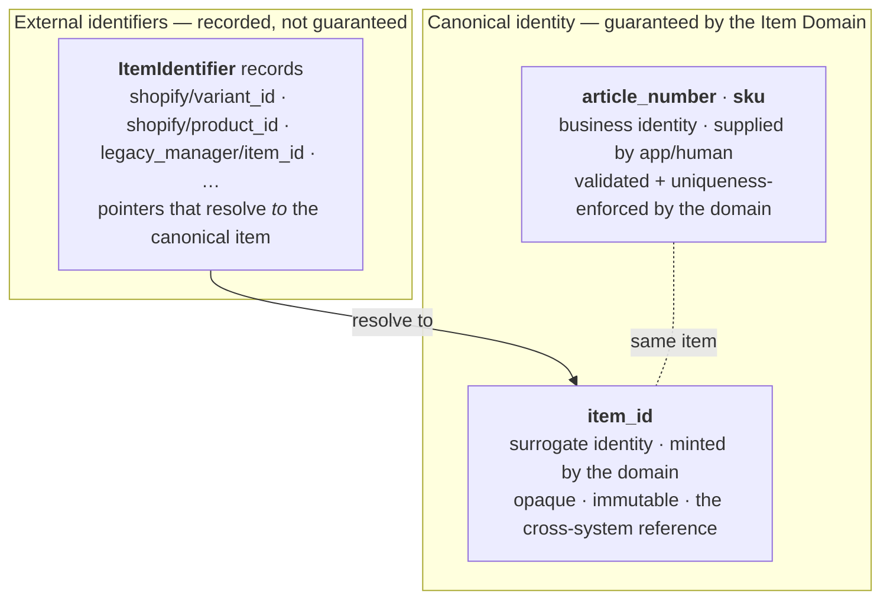

# 02 — Canonical Identity and Identifiers

> **Responsibility:** Provide the identities that name an item — those the Item Domain *guarantees*, and those it merely *records* — and let every existing identifier in the business resolve to the canonical item.
> **Status:** The three-layer identity model is **established**, and uniqueness is permanent. Format rules, mandatory-ness, mutability, value normalization and external-identifier lifecycle are **open**.

## Purpose

An item is known by many names: an article number, a SKU, a Shopify variant ID, a legacy ID in an old system.

These are **not all the same kind of thing**. What separates them is **who issues them**:

| | Issued by | Can the Item Domain guarantee uniqueness, format and stability? |
|---|---|---|
| `item_id` | The Item Domain itself | **Yes** — it mints the value. |
| `article_number` (at intake), `sku` (at publication) | Our own business (a person or an application) | **Yes** — we control the numbering schemes, so the domain can enforce uniqueness and normalization on every value it accepts. |
| Shopify product/variant ID, legacy app IDs, any other foreign ID | **Foreign authorities** — Shopify, a system we are replacing, any other external system | **No** — we don't control how they're assigned, whether they change, whether they collide, or whether they exist at all. The domain can only record them. |

This is the line that decides what is canonical. An identifier can only be *canonical identity* if the domain can guarantee it identifies exactly one item. For our own numbering schemes it can. For foreign ones it cannot — so those are recorded as pointers, not identity.

That gives three layers:



The third layer is what allows existing applications to keep their historical identifiers and still converge on one canonical identity **without a big-bang migration**: an application resolves what it has (e.g. `shopify/variant_id/482901284`) into an `item_id`, and from then on stores the `item_id`.

## Owns

| Concern | Detail |
|---|---|
| **`item_id`** | Generation and uniqueness. Minted by the domain at item creation. |
| **`article_number`, `sku`** | The *guarantee* — normalization and uniqueness enforcement on every supplied value, former values included. (The domain does **not** choose the value; see *Does Not Own*.) |
| **External identifiers** | The set of `ItemIdentifier` records and the rules governing them (namespace/type semantics, uniqueness, lifecycle). |
| **Resolution** | Resolving any of the above to the canonical item. |

## Does Not Own

| Not owned | Belongs to |
|---|---|
| **The choice of `article_number` / `sku` values** | The creating application or the person at intake. **ESTABLISHED:** the Item Domain does *not* generate business identifiers; it validates and enforces uniqueness on what it is given. The numbering scheme itself is a business convention; the domain imposes no format on it (`OQ-CID-03`). |
| The *meaning* of an external identifier inside its source system (e.g. what Shopify does with a variant ID) | The external system / integration worker |
| Assignment of external identifiers (Shopify assigns variant IDs; the supplier assigns its article numbers) | The external system |
| Application-local IDs for workflow records (task IDs, listing IDs) | Applications. These are not item identifiers and must not be registered as such. |
| Location or party identity | [Location](05-location-domain.md), [Party](06-party-domain.md) |

## Conceptual Model

```
Item
    item_id            ← surrogate canonical identity: minted by the domain, opaque, the cross-system reference
    article_number     ← canonical business identity: supplied, validated, unique
    sku                ← canonical business identity: supplied, validated, unique
    …                  (classification, dimensions, properties, images — see 01 and 03)

ExternalIdentifierType ← governed reference data, separate table; users can add new types (OQ-ID-04)
    id
    namespace          ← which kind of foreign system issues it  e.g. shopify, legacy_manager
    identifier_type    ← which of that system's identifiers      e.g. variant_id, product_id, article_number

ItemIdentifier         ← EXTERNAL identifiers only
    id                 ← identity of the identifier record itself
    item_id            ← the item this identifier resolves to
    type_id            ← → ExternalIdentifierType (namespace + identifier_type)
    value              ← the identifier value as a string, stored exactly as given — no normalization (OQ-ID-09)
    source_id          ← → Source: the registered app/system it comes from, e.g. shopify store x, manager app.
                         Set from the API key's request context, never from the payload (OQ-ID-05)
```

An item may carry several identifiers of the same type — one Shopify ID per shop it is listed in. `source` tells them apart (`OQ-ID-02`). There is no `metadata` field (`OQ-ID-05`).

Example from the brief:

```
item_id:          itm_123
namespace:        shopify
identifier_type:  variant_id
value:            482901284
source:           shopify store x   (from the calling app's API key)
```

**The rule:** `article_number` and `sku` are the only canonical business identities. **Any other identity an item has — from any system — is stored here**, as an external identifier. If an old system had its own field called "article number", its values go here under that system's namespace (e.g. `legacy_manager/article_number`), never into our `article_number` (`OQ-ID-10`).

### Canonical surrogate identity — `item_id`

- **CONFIRMED:** stable, unique, assigned by the Item Domain. **It remains the identity applications store and reference across systems** (see [10](10-application-integration.md)).
- **PROPOSED:** opaque (carries no business meaning), immutable, never reused.
- **CONFIRMED:** a prefixed string, `itm_` + the record's own unique id, a **UUIDv7** (`OQ-ID-07`). Examples in these documents shorten it to `itm_123`.
- Why a surrogate at all, given that `article_number` is also unique? Because an opaque key survives changes to business numbering schemes. If an article number is ever corrected, renumbered or migrated, every foreign key in every application would have to change with it. `item_id` never changes.

### Canonical business identity — `article_number` and `sku`

- **CONFIRMED:** both are canonical identity, not external identifiers. Both are **first-class attributes of the Item**, not `ItemIdentifier` records.
- **CONFIRMED:** they are **two distinct attributes**, each independently unique, and what distinguishes them is **when in the piece's life they are assigned**:

  | Identifier | Assigned when | Says |
  |---|---|---|
  | `article_number` | the piece is created / registered at intake | we have it and are tracking it |
  | `sku` | the restored piece is published for sale | it is being offered |

  Consequently `article_number` is **required at creation** and `sku` is **optional** — normally assigned at publication, but it may be sent at creation (`INV-CID-07`). A `sku` is not a workflow flag — see the caution in [01](01-item-domain.md#item).
- **CONFIRMED:** values are **supplied** by the creating application or a person; the Item Domain validates and enforces uniqueness but does not generate them.
- **CONFIRMED (by definition):** each must identify at most one item. An identifier that resolved to two items would not be identity.
- **CONFIRMED:** uniqueness is **permanent** — a soft-deleted item keeps its values and they are never reused by another item (`INV-CID-06`).
- **CONFIRMED:** both are **strings** with **no format restriction** (`OQ-CID-03`).
- **CONFIRMED:** values are **normalized** before storage: trimmed, lowercased, and inner spaces replaced with a single `-`. `" A 4932 "` is stored as `a-4932`. **Lookups and uniqueness ignore the `-`**, so searching `A 4932`, `a-4932` or `a4932` finds it — and `a4932` cannot be registered for another item (`OQ-CID-05`).
- **CONFIRMED:** empty values are rejected; there is no maximum length (`OQ-CID-03`).
- **CONFIRMED:** an item may go back to one of its own former values; that is recorded as a new change (`OQ-CID-04`).
- **CONFIRMED:** both **can change**, so typos can be corrected. The old value is **kept as a former value** of the item, and lookups match former values as well as current ones, so a label printed with the typo still finds the item. Former values count for uniqueness: no other item can ever take them (`OQ-CID-04`).

```
ItemBusinessIdentifierHistory      ← conceptual; part of the item aggregate
    item_id
    kind          ← article_number | sku
    value         ← the former (normalized) value
    replaced_at
```

### External identifiers — `ItemIdentifier`

- An external identifier is meaningful **only as the triple** `(namespace, identifier_type, value)`. The value `482901284` alone means nothing; `shopify/variant_id/482901284` does. (`INV-ID-03`)
- `namespace` answers *"which foreign authority issued this?"*; `identifier_type` answers *"which of that authority's identifiers is this?"*. A namespace may have several types (Shopify has `product_id` and `variant_id`).
- **CONFIRMED:** namespaces and types are **governed** by the Item Domain in a separate table (`ExternalIdentifierType`). Users can add new types; an identifier with an unknown type is rejected (`OQ-ID-04`).
- **CONFIRMED:** values are stored and matched **exactly as the external system issued them** — no normalization (`OQ-ID-09`).
- An `item_id`, `article_number` or `sku` is **never** registered as an `ItemIdentifier`. They are canonical; the identifier table is for foreign-issued values only. (`INV-ID-09`)

## Invariants

Full lists in [11-invariants.md](11-invariants.md#canonical-business-identifiers-article-number-sku) and [11-invariants.md](11-invariants.md#external-identifiers).

**Confirmed**

- `INV-CID-01` — `article_number` and `sku` are canonical identity and are first-class attributes of the Item, not `ItemIdentifier` records.
- `INV-CID-02` — Each of `article_number` and `sku` identifies at most one item.
- `INV-CID-03` — The Item Domain enforces uniqueness and normalization on supplied values; it does not generate them.
- `INV-CID-05` — Both may change; former values are kept and still matched by lookups.
- `INV-CID-06` — `article_number` and `sku` are permanently unique: a soft-deleted item keeps its values and they are never reused. Former values are covered too.
- `INV-CID-08` — Both are strings with no format restriction.
- `INV-CID-09` — Values are lowercased and spaces replaced with `-`, on write and on lookup.
- `INV-ID-01` — External identifiers (Shopify IDs, legacy app IDs, any other foreign ID) are never canonical identity.
- `INV-ID-02` — An `ItemIdentifier` record points at exactly one item.
- `INV-ID-03` — An external identifier resolves according to its `(namespace, identifier_type)` semantics; a bare value is never resolved without them.
- `INV-ID-04` — The same external value may be attached to several items; resolution returns a list.

**Proposed**

- `INV-CID-04` — `article_number` and `sku` are independent of each other; neither is derived from the other.
- `INV-ID-05` — External identifiers are added/removed only through Item Domain commands, which emit `ItemIdentifierAdded` / `ItemIdentifierRemoved`.
- `INV-ID-09` — Canonical identities are never registered as `ItemIdentifier`s.

**Open**


## Commands / Operations

**Canonical business identity** (part of the item aggregate, guarded by `item.version`):

| Command (conceptual) | Notes |
|---|---|
| Supplied as part of `CreateItem` | `article_number` required, `sku` optional (`OQ-CID-02`). Normalized before storage. |
| `SetItemArticleNumber` / `SetItemSku` (or via a general `UpdateItem`) | Corrects a value (`OQ-CID-04`). The new value is normalized and must not be held — currently or formerly — by another item. The old value moves to the item's history. Increments `item.version`. Granularity follows `OQ-API-02`. |

**External identifiers:**

| Command (conceptual) | Notes |
|---|---|
| `AddItemIdentifier { item_id, namespace, identifier_type, value }` — source taken from the API key | The type must exist in `ExternalIdentifierType`. Value stored as given. The same value may already be on other items (`OQ-ID-01`). |
| `CreateExternalIdentifierType { namespace, identifier_type }` | Reference data: adds a new accepted kind of external ID (`OQ-ID-04`). |
| `RemoveItemIdentifier { item_id, identifier_id }` or by triple | Retention of removed identifiers is open (`OQ-ID-06`). |
| `ReassignItemIdentifier` (move an identifier from item A to item B) | **Not defined.** Not needed for merging — that does not exist (`OQ-ITEM-04` resolved) — but possibly needed to move a Shopify or legacy identifier off a soft-deleted duplicate onto the surviving item (`OQ-ID-06`). Do not assume it exists. |

## Queries

| Query | Purpose |
|---|---|
| **`GetItemByArticleNumber(value) → item`** | Direct lookup on a canonical attribute. Used by Scanner and by humans searching. The input is normalized first; matches the current **or a former** value, and says which (so an app can flag an outdated label). |
| **`GetItemBySku(value) → item`** | Same. |
| **`ResolveExternalIdentifier(namespace, identifier_type, value) → [item]`** | The bridge query for foreign IDs. Used by integrations and by every application during migration. Returns a **list** — none, one or several items — because the same value may be on several items (`OQ-ID-01`). |
| `ListIdentifiers(item_id)` | All external identifiers for an item. |
| `ResolveExternalIdentifiers([...]) → [...]` (batch) | Bulk resolution for imports / projections. |
| `FindItemsByAnyIdentifierValue(value)` | Convenience for humans (Manager app search) across canonical *and* external values. Not a resolution primitive; results are inherently ambiguous. **Proposed**, not required. |

Note the asymmetry, and that it is deliberate: canonical business identifiers are **looked up directly** because they are attributes of the item; external identifiers are **resolved** because they are pointers.

## Events

| Event | Payload (minimum) |
|---|---|
| `ItemCreated` | includes `article_number` and `sku` (canonical attributes) |
| `ItemUpdated` (or a finer-grained equivalent) | when `article_number` / `sku` change: carries the **old and new** value |
| `ItemIdentifierAdded` | `item_id`, `version`, `namespace`, `identifier_type`, `value` |
| `ItemIdentifierRemoved` | `item_id`, `version`, `namespace`, `identifier_type`, `value` |

Consumers such as the Shopify integration worker may key their own mappings off the identifier events.

## Relationships

| Counterpart | Relationship |
|---|---|
| Applications | Each existing application holds foreign identifiers (its own legacy IDs). During migration these are registered as `ItemIdentifier`s so the app can resolve to `item_id`. See [10](10-application-integration.md). |
| Shopify integration | Shopify product/variant IDs are external identifiers in the `shopify` namespace. Shopify both supplies and consumes item facts, like every connected app; the Item Domain is the authority (`OQ-MIG-04`). |
| Scanner | Scans resolve to an item — by `article_number` / `sku` if the label carries ours, by external resolution if it carries a foreign code. |
| Inventory | Inventory references `item_id` only — it never stores or resolves any other identifier. |

## Example Flow

### Scanner reads one of our own labels

1. Scanner reads article number `A-4932`.
2. Scanner calls `GetItemByArticleNumber("A-4932")`; the domain normalizes it to `a-4932` → `itm_123`.
3. Scanner proceeds with its own workflow using `itm_123`; it may then issue an *Inventory* command such as `place()`.

No namespace is involved, because this is our own numbering scheme — a canonical attribute, not a foreign pointer.

### Shopify sync worker receives a product update

1. Worker receives a webhook for Shopify variant `482901284`.
2. Worker calls `ResolveExternalIdentifier(shopify, variant_id, "482901284")`.
3. Result `itm_123` → worker proceeds using the canonical ID.
4. Result *not found* → the worker's behaviour is a **business decision** (create an item? queue for manual matching? ignore?). Not specified (Shopify may supply facts — `OQ-MIG-04` — but what triggers item creation is `OQ-APP-04`).

### Migration of the Manager app's legacy IDs (illustrative)

1. For each Manager-app item record, a canonical item is created (or matched to an existing one — matching rules open, `OQ-MIG-02`), carrying its `article_number` and `sku` as canonical attributes.
2. `AddItemIdentifier { namespace: legacy_manager, identifier_type: item_id, value: "<old id>" }` is issued for the app's internal surrogate.
3. The Manager app can now resolve its old IDs to `item_id` lazily, and store `item_id` on new records, without rewriting its history in one go.

## Failure / Conflict Cases

| Case | Behaviour |
|---|---|
| `CreateItem` / update with an `article_number` already held by another item | **Rejected** — uniqueness is what makes it identity (`INV-CID-02`). |
| Same for `sku` | Rejected. |
| `article_number` in an unusual format | Accepted — there is no format rule (`OQ-CID-03`). Only uniqueness after normalization is checked. |
| Item created without `article_number` / `sku` | Depends on `OQ-CID-02`. (Creation without a *classification* is always rejected — `INV-ITEM-09`.) |
| Reusing the `article_number` of a soft-deleted item | **Rejected.** Uniqueness is permanent; deleted items keep their values (`INV-CID-06`). |
| Change an `article_number` / `sku` | Allowed (`OQ-CID-04`). The old value is kept as a former value. `item_id` shields all application references. |
| Change to a value another item holds now or held before | **Rejected** as a conflict (`INV-CID-06`). |
| Lookup with a former value (e.g. an old label with the typo) | Returns the item, marked as a former-value match. |
| `AddItemIdentifier` with a value already attached to *another* item | **Accepted** — a value may be on several items (`OQ-ID-01`). |
| `AddItemIdentifier` with a triple already attached to the *same* item | Idempotent no-op (proposed). |
| Attempt to register our own `article_number` as an `ItemIdentifier` | Rejected (`INV-ID-09`) — it is canonical, not a pointer. |
| External resolution finds more than one item | Normal: the list is returned; the caller decides. The domain never picks one silently. |
| `"A 4932"` supplied when `a-4932` already exists on another item | **Rejected** — both normalize to `a-4932` (`OQ-CID-05`). External values are **not** normalized (`OQ-ID-09`). |
| `AddItemIdentifier` with a type not in `ExternalIdentifierType` | **Rejected** (`OQ-ID-04`). |

## Established Decisions

- Identity has three layers: the domain-minted surrogate `item_id`; the business identities `article_number` and `sku`; and recorded external identifiers.
- **`article_number` and `sku` are canonical identity**, are first-class attributes of the Item, and are two distinct attributes each independently unique.
- Their values are **supplied** by the creating application or person; the Item Domain **enforces** uniqueness and normalization but does **not generate** them.
- They are strings with no format rule, are normalized (lowercase, spaces → `-`), and can change; former values are kept and still found by lookups.
- **`item_id` remains the identity applications store and reference across systems.**
- External identifiers — Shopify product/variant IDs, legacy system IDs, any other foreign IDs — are **not** canonical identity. They are modelled as `ItemIdentifier` records with a governed type (`namespace` + `identifier_type`), a `value` stored exactly as given, and a `source` (the specific shop or app), attached to an `item_id`.
- The purpose of the external-identifier model is to let existing systems resolve their identifiers to `item_id` **without** requiring immediate migration of every application's historical identifiers.
- Canonical identities are never registered as `ItemIdentifier`s.
- External identifier values are **not unique across items**: apps may attach the same value to several items as their own tags, and resolution returns a list.

## Open Questions

See [12-open-questions.md — Identity](12-open-questions.md#identity).

**Canonical business identifiers**

- `OQ-CID-01` — **RESOLVED:** they mark different lifecycle stages — `article_number` at registration, `sku` at publication for sale.
- `OQ-CID-02` — **RESOLVED:** `article_number` is required at creation; `sku` is optional (normally assigned at publication).
- `OQ-CID-03` — **RESOLVED:** strings, no format restriction, no max length; empty values rejected.
- `OQ-CID-04` — **RESOLVED:** mutable; former values kept and matched by lookups; an item may go back to its own former value.
- `OQ-CID-05` — **RESOLVED:** permanent uniqueness; trimmed, lowercased, spaces → `-`; matching ignores `-`.

**External identifiers**

- `OQ-ID-01` — **RESOLVED:** no uniqueness across items; a value may be on several items (apps' tags); resolution returns a list.
- `OQ-ID-02` — **RESOLVED:** yes, e.g. one Shopify ID per shop; `source` tells them apart.
- `OQ-ID-03` — **RESOLVED:** yes (see `OQ-ID-01`).
- `OQ-ID-04` — **RESOLVED:** governed, in a separate table; users can add types.
- `OQ-ID-05` — **RESOLVED:** `source` is the specific shop/app, from the governed `Source` table; set from the API key, never the payload; `metadata` removed.
- `OQ-ID-06` — External identifier lifecycle: removal history, reassignment between items.
- `OQ-ID-07` — `item_id` format. **Prefix resolved (`itm_`)**; the suffix scheme is open.
- `OQ-ID-08` — **RESOLVED:** the Item Domain does not generate business identifiers; values are supplied and the domain validates them.
- `OQ-ID-09` — **RESOLVED:** no normalization; stored exactly as the external system issued it.
- `OQ-ID-10` — **RESOLVED:** any identity other than `article_number` and `sku` is an external identifier.
