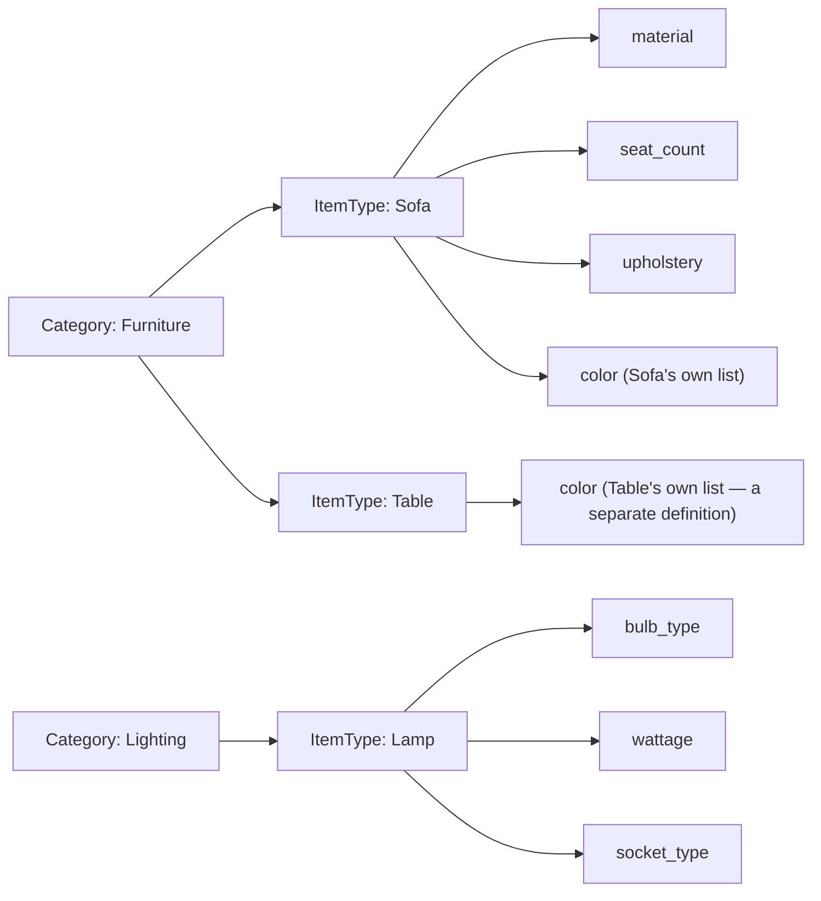

# 03 — Classification and Properties

> **Responsibility:** Define *what kind of thing* an item is, and use that to determine *which properties are legal* for it.
> **Status:** Concept established. Scope precedence, reference-data governance, definition evolution and reclassification semantics are **open**.

## Purpose

Different kinds of items have different meaningful attributes. A sofa has a seat count and upholstery; a lamp has a bulb type and wattage. Neither has the other's attributes.

We do **not** want a single `Item` table with a column for every attribute any item type might ever have. That approach:

- produces a sparse, ever-growing table nobody can reason about;
- cannot express "this attribute is *required* for lamps but *meaningless* for sofas";
- requires a schema change every time a new item type appears.

Instead, classification is explicit, and properties are **defined per classification** and **validated against those definitions**. The classification system's job is to answer, for any item and any property:

> *"Is this property legal for this item, and is this value valid?"*

**Properties are conditional; dimensions and weight are not.** Every physical object has dimensions and a weight regardless of what kind of thing it is, so those are universal first-class attributes of the Item ([01](01-item-domain.md)). Properties are the opposite: they are **conditional attributes, meaningful only given the item's category and type**. That distinction is the whole reason this vocabulary exists (`OQ-ITEM-03`).

## Owns

- The classification vocabulary: `Category`, `ItemType`.
- The presentational assets for that vocabulary: each `Category` and `ItemType` carries one optional `icon_url`.
- The property vocabulary: `PropertyDefinition` (name, data type, unit, required flag, constraints, and the item type it belongs to).
- The assignment of property values to items: `ItemProperty`.
- The **validation rules** that connect them.

All of this is owned by the **Item Domain** — classification is not a separate domain. It is documented separately only because it is a distinct responsibility with its own open questions.

## Does Not Own

| Not owned | Belongs to |
|---|---|
| Workflow-relevant attributes such as "photographed", "priced", "listed" | Applications. These are process facts, not properties of the thing. |
| Sales copy — listing titles and descriptions | The sales channel (Seller/Shopify) (`OQ-PROP-06`). Users may define a `title` property on a type if they want one; that is their vocabulary choice, not a system field. |
| Pricing attributes | Not assigned to any centralized domain in this architecture. |
| Inventory-related attributes (quantity, location) | [Inventory](04-inventory-domain.md) |
| Application-specific tags, labels, filters | Applications |

## Conceptual Model

```
Category
    id
    name
    icon_url             ← optional presentational asset; none when missing (OQ-IMG-07)

ItemType
    id
    category_id          ← an item type belongs to exactly one category (confirmed, INV-CLS-03);
                           this is the only place an item's category is stored (OQ-CLS-05)
    name
    icon_url             ← same name and rules as on Category

PropertyDefinition
    id
    item_type_id                      ← definitions live only on item types (OQ-PROP-01)
    name                              ← e.g. material, seat_count, bulb_type; unique within the type
    data_type                         ← text | whole_number | decimal | boolean | choice (OQ-PROP-02)
    choices                           ← for data_type = choice: the list of values a user can pick from
    multiple                          ← for data_type = choice: whether several values may be picked (default: one)
    unit                              ← e.g. cm, kg, W (nullable)
    required                          ← whether an item of this type must carry a value
    constraints                       ← e.g. min/max, pattern

ItemProperty
    item_id
    property_definition_id
    value
```



Examples from the brief:

| Category | ItemType | Possible properties |
|---|---|---|
| Furniture | Sofa | material, seat_count, color, upholstery, style |
| Lighting | Lamp | bulb_type, wattage, socket_type |

### Presentational assets on the vocabulary

`Category` and `ItemType` each carry one `icon_url`, named the same on both. It is optional: when missing, the API returns none, and each application decides what to draw instead (`OQ-IMG-07`).

These are presentation, which might look like application territory. They belong here for the same reason the vocabulary itself does: if each application picked its own icon for "Furniture", the same category would look like a different thing in the Manager app, the Seller app and the Scanner. The icon is part of what the category *is* to the business, so it lives with the category and every application renders the same one.

Note the contrast with item images. An item's images are *evidence of what that specific thing looks like*; a category's icon is *a label for a concept*. Both are canonical, for different reasons. Mandatory-ness and fallbacks: resolved in `OQ-IMG-07`.

### How validation works (conceptual)

An item stores only its `item_type_id`; its category is `item_type.category_id`. The set of **allowed property definitions** is:

```
allowed(item) = the property definitions of item.item_type_id
```

Definitions live only on item types, so `Sofa.color` and `Table.color` are separate definitions, each with its own choices. Picking a type gives a form exactly that type's definitions. **Searching by property name without a type searches every definition with that name** — so consistent naming across types (`color`, not sometimes `colour`) is what makes such a search work.

Because an item can never be unclassified (`INV-ITEM-09`), `allowed(item)` is always well-defined — there is no "not classified yet" edge case for validation to handle.

Then:

1. Every `ItemProperty` on the item must reference a definition in `allowed(item)`. (`INV-CLS-01`, confirmed)
2. Every `ItemProperty.value` must satisfy its definition's `data_type` and `constraints`. (`INV-CLS-02`, confirmed)
3. Every definition in `allowed(item)` with `required = true` must have a value — enforced at creation and on every write (`OQ-ITEM-06`, `OQ-PROP-03`).

These rules are checked on **writes**. When a later definition change makes an existing item non-conforming, the item is not rejected retroactively; it appears in the **resolution list** (see *Non-conforming items* below).


### Reference data vs item data

| Kind | Entities | Lifecycle |
|---|---|---|
| **Reference data** (vocabulary) | `Category`, `ItemType`, `PropertyDefinition` | Changes rarely; changes affect *all* items of that classification. **Any application or user may change it**; every change is recorded in the polymorphic history table (`OQ-CLS-02`). |
| **Item data** | `Item`, `ItemProperty`, `ItemIdentifier`, `ItemImage` | Changes per item; guarded by the item's version. |

Changing reference data is a **different kind of operation** from changing an item and should be treated as such by the API.

### Changing item types

| Change | What happens |
|---|---|
| **Rename a type** | Only the type changes. Items point at it by id, so no item is touched; an event tells applications to update their cached name. |
| **Change a type's property definitions** | The definition changes and applications are told. Items that no longer conform appear in the resolution list (below). |
| **Create a type** | Items can then be created with it, or moved to it. |
| **Delete a type that still has items** | The delete request **must name the type the items move to** — an item always has a type. The items move in the same operation and take on the new type's definitions. |
| **Change one item's type** | Allowed; the same move, for one item. |

**Property values on a move (`OQ-CLS-03`).** Definitions belong to types, so no value carries over by itself:

1. A value **carries over** when the new type has a definition with the **same name** and the value is valid for it (`red` moves if the new colour list contains `red`).
2. Every other value is **recorded in the polymorphic history table and removed** from the item.
3. An item missing a value the new type **requires** goes to the **resolution list** — the move is never blocked. Deleting a type with 200 items therefore cannot fail over one missing value.

### Non-conforming items

A definition change — a property becoming `required`, a tightened constraint — can leave existing items that no longer conform. That is allowed (`OQ-PROP-03`). Instead of rejecting the change or hiding the problem, the Item Domain offers a **dedicated set of endpoints and services** to:

- **list** the items that no longer conform to their definitions;
- **see** an item and what exactly is wrong with it;
- **resolve** it (set the missing value, correct the out-of-range one).

A definition change thereby becomes a prompt for people to re-evaluate the items it concerns. How the list is computed, and whether other writes to a non-conforming item are allowed meanwhile, are small open points in `OQ-PROP-03`.

## Invariants

Full list in [11-invariants.md](11-invariants.md#classification-and-properties).

**Confirmed**

- `INV-CLS-01` — Properties assigned to an item must conform to the property definitions allowed for the item's classification.
- `INV-CLS-02` — A property value must satisfy its definition's data type and constraints.

**Proposed**

- `INV-CLS-03` — An `ItemType` belongs to exactly one `Category`.
- `INV-CLS-04` — An item carries at most one value per `PropertyDefinition` (multi-valued properties would be modelled explicitly in the definition, `OQ-PROP-02`).
- `INV-CLS-05` — Required properties must be present **at creation**; an item cannot be created missing one. (`OQ-ITEM-06` resolved.)
- `INV-CLS-06` — A `PropertyDefinition` cannot be deleted while items carry values for it (deprecate instead).

**Also confirmed**

- `INV-CLS-08` — Reclassification: same-named valid values carry over, the rest go to history, missing required values go to the resolution list (`OQ-CLS-03`).
- `INV-CLS-10` — An item never carries a property without a definition (`OQ-PROP-04`).

## Commands / Operations

**On items** (guarded by item version):

| Command (conceptual) | Validation |
|---|---|
| `ClassifyItem { item_id, item_type_id }` | Item type exists; category follows from it. Property values carried over, removed or sent to the resolution list as described above (`OQ-CLS-03`). |
| `SetItemProperty { item_id, property_definition_id (or name), value }` | Definition in `allowed(item)`; value satisfies data type/constraints. |
| `RemoveItemProperty { item_id, property_definition_id }` | If `required`, behaviour open (reject vs allow-incomplete). |

**On reference data** (any application or user; every change recorded in the polymorphic history table — `OQ-CLS-02`):

| Command (conceptual) | Notes |
|---|---|
| `CreateCategory`, `RenameCategory` | |
| `CreateItemType { category_id, name }` | |
| `RenameItemType` | Touches no item; applications update cached names. |
| `DeleteItemType { item_type_id, move_items_to }` | Required target when the type has items; items move in the same operation (`OQ-CLS-03`). |
| Moving an `ItemType` to another category | **Recategorises every item of that type** at once, with no item version bump or item event, because items derive their category from their type. Whether this is allowed is governance (`OQ-CLS-02`). |
| `DefineProperty { item_type_id, name, data_type, choices?, multiple?, unit, required, constraints }` | Name unique within the type. |
| `ChangePropertyDefinition` | Allowed. Tightening constraints or adding `required` can make existing items non-conforming; they then appear in the resolution list (`OQ-PROP-03`). |
| `DeprecatePropertyDefinition` | Proposed alternative to deletion. |

## Queries

| Query | Who needs it |
|---|---|
| List categories; list item types for a category | Manager, Worker, Seller (forms, filters) |
| **Get allowed property definitions for an item type** (incl. data type, unit, required, constraints) | Any application rendering an edit form or validating client-side before sending a command |
| Get properties of an item (with definitions resolved) | All applications, projections |
| Validate a candidate property set without committing (dry run) | **Proposed**, useful for forms; not required |

## Events

| Event | Emitted when |
|---|---|
| `ItemClassificationChanged` | Item's category/type changed. |
| `ItemPropertyChanged` | Property value set, changed or removed. |
| Reference-data events (`CategoryCreated`, `ItemTypeCreated`, `PropertyDefined`, `PropertyDefinitionChanged`, …) | **Proposed.** Applications that cache the vocabulary for forms will need them. Not in the brief's initial list. |

## Relationships

- **Item aggregate:** `ItemProperty` is part of the item; `Category`/`ItemType`/`PropertyDefinition` are referenced by it.
- **Applications:** consume the vocabulary to build forms and validate early; the Item Domain remains the final validator.
- **Seller / Shopify integration:** will likely map canonical properties to channel-specific attributes (e.g. Shopify metafields). That mapping is the integration's responsibility, not the Item Domain's.
- **Inventory:** no relationship. Inventory does not care about properties.

## Example Flow

### Setting properties on a sofa

1. Worker app fetches allowed definitions for `ItemType: Sofa` → `material (string, required)`, `seat_count (number, min 1)`, `color`, `upholstery`, `style`.
2. Worker renders a form with exactly those fields.
3. Worker sends `SetItemProperty { item_id: itm_123, expected_version: 18, name: seat_count, value: 3 }`.
4. Item Domain checks: `seat_count` ∈ `allowed(itm_123)` ✔, `3` is a number ≥ 1 ✔ → commit, `version: 19`, emit `ItemPropertyChanged`.

### Rejected property

1. Someone sends `SetItemProperty { item_id: itm_123, name: bulb_type, value: "E27" }` for the sofa.
2. `bulb_type` ∉ `allowed(itm_123)` → **validation error**. No state change, no event.

### Reclassification (illustrative — behaviour open)

1. `itm_123` is reclassified from `Furniture/Sofa` to `Furniture/Armchair`.
2. `seat_count` is not defined for Armchair. The Item Domain must either reject the reclassification, drop the property, or require the command to say what to do. **This is `OQ-CLS-03`; do not implement a default silently.**

## Failure / Conflict Cases

| Case | Behaviour |
|---|---|
| Property not allowed for classification | Validation error. |
| Value violates data type / constraints | Validation error. |
| Unknown item type | Validation error. (Type/category disagreement cannot occur: the item stores no category, `OQ-CLS-05`.) |
| Reclassification leaves values the new type doesn't define | Recorded in the history table and removed (`OQ-CLS-03`). |
| Reclassification leaves a required value missing | Item goes to the resolution list; the move succeeds. |
| Deleting a type with items without naming a target type | Rejected. |
| Several values picked for a single-choice property, or for a non-choice property | Validation error (`OQ-PROP-02`). |
| Reference-data change makes existing items non-conforming | Change **accepted**; the items appear in the resolution list for users to fix (`OQ-PROP-03`). |
| Concurrent property edits on the same item | Version conflict on the item (if properties are inside the aggregate — `OQ-ITEM-05`). |
| Deleting a definition in use | Rejected (`INV-CLS-06`, proposed). |

## Established Decisions

- Items are classified by `Category` and `ItemType`.
- Classification determines which properties make sense for an item.
- There is **no** giant item table with every possible property column; properties are definition-driven.
- The conceptual model consists of `Category`, `ItemType`, `PropertyDefinition`, `ItemProperty`.
- The system must be able to validate whether a property is legal for a particular item.
- An item stores only its `item_type_id`; its category is derived from the item type (`OQ-CLS-05`).
- Exact persistence/schema design is **not** finalized.

## Open Questions

See [12-open-questions.md — Classification](12-open-questions.md#classification) and [— Properties](12-open-questions.md#properties).

- `OQ-CLS-01` — Is the hierarchy fixed at two levels (Category → ItemType)?
- `OQ-CLS-02` — **Resolved:** anyone (apps or users); every change recorded in the polymorphic history table.
- `OQ-CLS-03` — **Resolved:** see *Changing item types*.
- `OQ-CLS-05` — **Resolved:** yes, redundant. The item stores no `category_id`.
- `OQ-PROP-01` — **Resolved:** definitions live only on item types.
- `OQ-PROP-02` — **Resolved:** text, whole number, decimal, boolean, choice list (one or several picks).
- `OQ-PROP-03` — **Resolved:** changes allowed; non-conforming items are listed, shown and resolved through dedicated endpoints.
- `OQ-PROP-04` — **Resolved:** no; every value belongs to a definition of the item's type.
- `OQ-PROP-05` — Localization of names/values.
- `OQ-PROP-06` — **Resolved:** no canonical title/description; channel copy belongs to the channel.
