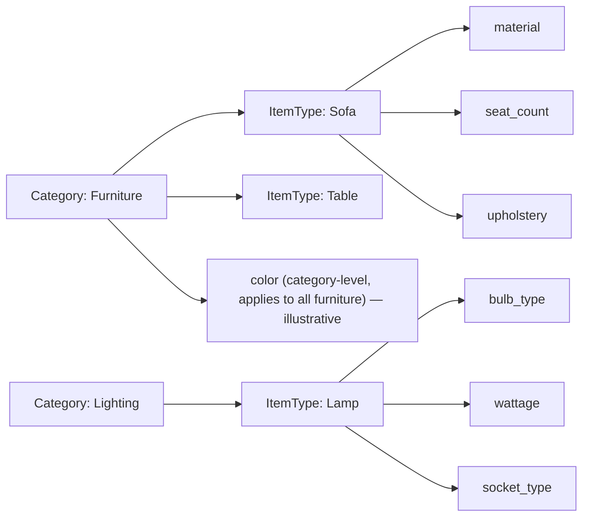

# 03 — Classification and Properties

> **Responsibility:** Define *what kind of thing* an item is, and use that to determine *which properties are legal* for it.
> **Status:** Concept established. Scope precedence, reference-data governance, definition evolution and reclassification semantics are **open**.

## Purpose

Different kinds of items have different meaningful attributes. A sofa has a seat count and upholstery; a lamp has a bulb type and wattage. Neither has the other's attributes.

We do **not** want a single `Item` table with a column for every attribute any item type might ever have. That approach:

- produces a sparse, ever-growing table nobody can reason about;
- cannot express "this attribute is *required* for lamps but *meaningless* for sofas";
- requires a schema change every time a new item type appears.

Instead, classification is explicit, and properties are **defined per classification** and **validated against those definitions**. The classification system's job is to answer, for any item and any property:

> *"Is this property legal for this item, and is this value valid?"*

## Owns

- The classification vocabulary: `Category`, `ItemType`.
- The property vocabulary: `PropertyDefinition` (name, data type, unit, required flag, constraints, and the classification it applies to).
- The assignment of property values to items: `ItemProperty`.
- The **validation rules** that connect them.

All of this is owned by the **Item Domain** — classification is not a separate domain. It is documented separately only because it is a distinct responsibility with its own open questions.

## Does Not Own

| Not owned | Belongs to |
|---|---|
| Workflow-relevant attributes such as "photographed", "priced", "listed" | Applications. These are process facts, not properties of the thing. |
| Sales copy / marketing descriptions per channel | **Open** (`OQ-PROP-06`). A Shopify listing title written for a campaign is probably channel-specific; a canonical descriptive name may be canonical (`OQ-ITEM-02`). Do not assume. |
| Pricing attributes | Not assigned to any centralized domain in this architecture. |
| Inventory-related attributes (quantity, location) | [Inventory](04-inventory-domain.md) |
| Application-specific tags, labels, filters | Applications |

## Conceptual Model

```
Category
    id
    name

ItemType
    id
    category_id          ← an item type belongs to exactly one category (proposed)
    name

PropertyDefinition
    id
    category_id and/or item_type_id   ← the scope in which the property applies (precedence open, OQ-PROP-01)
    name                              ← e.g. material, seat_count, bulb_type
    data_type                         ← e.g. string, number, boolean, enum … (supported set open, OQ-PROP-02)
    unit                              ← e.g. cm, kg, W (nullable)
    required                          ← whether an item of this classification must carry a value
    constraints                       ← e.g. allowed values, min/max, pattern

ItemProperty
    item_id
    property_definition_id
    value
```



Examples from the brief:

| Category | ItemType | Possible properties |
|---|---|---|
| Furniture | Sofa | material, seat_count, color, upholstery, style |
| Lighting | Lamp | bulb_type, wattage, socket_type |

### How validation works (conceptual)

For an item classified as `(category_id, item_type_id)`, the set of **allowed property definitions** is:

```
allowed(item) = definitions scoped to item.item_type_id
              ∪ definitions scoped to item.category_id      (if category-level definitions are adopted)
```

Then:

1. Every `ItemProperty` on the item must reference a definition in `allowed(item)`. (`INV-CLS-01`, confirmed)
2. Every `ItemProperty.value` must satisfy its definition's `data_type` and `constraints`. (`INV-CLS-02`, confirmed)
3. Every definition in `allowed(item)` with `required = true` must have a value — **when** this is enforced (at creation? at classification? at "completion"?) is open (`OQ-PROP-03`, `OQ-ITEM-06`).

The precedence when a property is defined at both category and item-type level (e.g. `color` on Furniture and a narrower `color` enum on Sofa) is open (`OQ-PROP-01`).

### Reference data vs item data

| Kind | Entities | Lifecycle |
|---|---|---|
| **Reference data** (vocabulary) | `Category`, `ItemType`, `PropertyDefinition` | Changes rarely; changes affect *all* items of that classification; governed by someone (open, `OQ-CLS-02`). |
| **Item data** | `Item`, `ItemProperty`, `ItemIdentifier` | Changes per item; guarded by the item's version. |

Changing reference data is a **different kind of operation** from changing an item and should be treated as such by the API and by authorization.

## Invariants

Full list in [11-invariants.md](11-invariants.md#classification-and-properties).

**Confirmed**

- `INV-CLS-01` — Properties assigned to an item must conform to the property definitions allowed for the item's classification.
- `INV-CLS-02` — A property value must satisfy its definition's data type and constraints.

**Proposed**

- `INV-CLS-03` — An `ItemType` belongs to exactly one `Category`.
- `INV-CLS-04` — An item carries at most one value per `PropertyDefinition` (multi-valued properties would be modelled explicitly in the definition, `OQ-PROP-02`).
- `INV-CLS-05` — Required properties must be present for an item to be considered *complete*; whether incompleteness blocks a command or is merely reportable is open.
- `INV-CLS-06` — A `PropertyDefinition` cannot be deleted while items carry values for it (deprecate instead).

**Open**

- What happens to properties that become illegal after reclassification (`OQ-CLS-03`).
- Whether properties without a definition are ever permitted (`OQ-PROP-04`).

## Commands / Operations

**On items** (guarded by item version):

| Command (conceptual) | Validation |
|---|---|
| `ClassifyItem { item_id, category_id, item_type_id }` | Type belongs to category. Existing properties re-validated (`OQ-CLS-03`). |
| `SetItemProperty { item_id, property_definition_id (or name), value }` | Definition in `allowed(item)`; value satisfies data type/constraints. |
| `RemoveItemProperty { item_id, property_definition_id }` | If `required`, behaviour open (reject vs allow-incomplete). |

**On reference data** (governance open, `OQ-CLS-02`):

| Command (conceptual) | Notes |
|---|---|
| `CreateCategory`, `RenameCategory` | |
| `CreateItemType { category_id, name }` | |
| `DefineProperty { scope, name, data_type, unit, required, constraints }` | |
| `ChangePropertyDefinition` | **Dangerous**: tightening constraints or adding `required` can invalidate existing items. Policy open (`OQ-PROP-03`). |
| `DeprecatePropertyDefinition` | Proposed alternative to deletion. |

## Queries

| Query | Who needs it |
|---|---|
| List categories; list item types for a category | Manager, Worker, Seller (forms, filters) |
| **Get allowed property definitions for an item type** (incl. data type, unit, required, constraints) | Any application rendering an edit form or validating client-side before sending a command |
| Get properties of an item (with definitions resolved) | All applications, projections |
| Validate a candidate property set without committing (dry run) | **Proposed**, useful for forms; not required |

## Events

| Event | Emitted when |
|---|---|
| `ItemClassificationChanged` | Item's category/type changed. |
| `ItemPropertyChanged` | Property value set, changed or removed. |
| Reference-data events (`CategoryCreated`, `ItemTypeCreated`, `PropertyDefined`, `PropertyDefinitionChanged`, …) | **Proposed.** Applications that cache the vocabulary for forms will need them. Not in the brief's initial list. |

## Relationships

- **Item aggregate:** `ItemProperty` is part of the item; `Category`/`ItemType`/`PropertyDefinition` are referenced by it.
- **Applications:** consume the vocabulary to build forms and validate early; the Item Domain remains the final validator.
- **Seller / Shopify integration:** will likely map canonical properties to channel-specific attributes (e.g. Shopify metafields). That mapping is the integration's responsibility, not the Item Domain's.
- **Inventory:** no relationship. Inventory does not care about properties.

## Example Flow

### Setting properties on a sofa

1. Worker app fetches allowed definitions for `ItemType: Sofa` → `material (string, required)`, `seat_count (number, min 1)`, `color`, `upholstery`, `style`.
2. Worker renders a form with exactly those fields.
3. Worker sends `SetItemProperty { item_id: itm_123, expected_version: 18, name: seat_count, value: 3 }`.
4. Item Domain checks: `seat_count` ∈ `allowed(itm_123)` ✔, `3` is a number ≥ 1 ✔ → commit, `version: 19`, emit `ItemPropertyChanged`.

### Rejected property

1. Someone sends `SetItemProperty { item_id: itm_123, name: bulb_type, value: "E27" }` for the sofa.
2. `bulb_type` ∉ `allowed(itm_123)` → **validation error**. No state change, no event.

### Reclassification (illustrative — behaviour open)

1. `itm_123` is reclassified from `Furniture/Sofa` to `Furniture/Armchair`.
2. `seat_count` is not defined for Armchair. The Item Domain must either reject the reclassification, drop the property, or require the command to say what to do. **This is `OQ-CLS-03`; do not implement a default silently.**

## Failure / Conflict Cases

| Case | Behaviour |
|---|---|
| Property not allowed for classification | Validation error. |
| Value violates data type / constraints | Validation error. |
| Item type does not belong to category | Validation error (`INV-CLS-03`, proposed). |
| Reclassification invalidates properties | Open (`OQ-CLS-03`). |
| Reference-data change invalidates existing items | Open (`OQ-PROP-03`). Options include: reject the change; allow and flag items as incomplete; version the definitions. |
| Concurrent property edits on the same item | Version conflict on the item (if properties are inside the aggregate — `OQ-ITEM-05`). |
| Deleting a definition in use | Rejected (`INV-CLS-06`, proposed). |

## Established Decisions

- Items are classified by `Category` and `ItemType`.
- Classification determines which properties make sense for an item.
- There is **no** giant item table with every possible property column; properties are definition-driven.
- The conceptual model consists of `Category`, `ItemType`, `PropertyDefinition`, `ItemProperty`.
- The system must be able to validate whether a property is legal for a particular item.
- Exact persistence/schema design is **not** finalized.

## Open Questions

See [12-open-questions.md — Classification](12-open-questions.md#classification) and [— Properties](12-open-questions.md#properties).

- `OQ-CLS-01` — Is the hierarchy fixed at two levels (Category → ItemType)?
- `OQ-CLS-02` — Who governs reference data, through what interface?
- `OQ-CLS-03` — Reclassification semantics for now-illegal properties.
- `OQ-CLS-05` — Is `item.category_id` redundant given `item_type.category_id`?
- `OQ-PROP-01` — Precedence between category-level and item-type-level definitions.
- `OQ-PROP-02` — Supported data types; multi-valued properties; enums.
- `OQ-PROP-03` — Evolution of definitions and the effect on existing items; when `required` is enforced.
- `OQ-PROP-04` — Are undefined ("free-form") properties ever permitted?
- `OQ-PROP-05` — Localization of names/values.
- `OQ-PROP-06` — Which descriptive attributes are canonical vs channel-specific sales copy.
