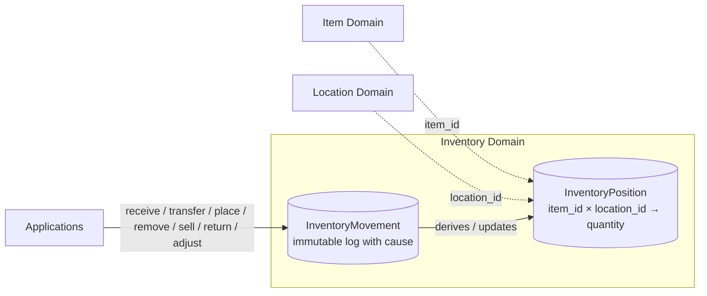

# 04 — Inventory Domain

> **Question this domain answers:** *"How much of it exists operationally, and where?"*
> **Status:** Initial design. Separation from Item is established; the operation set, quantity semantics and rules such as negative inventory are **open**.

## Purpose

Inventory is deliberately **separate** from Item.

| Item answers | Inventory answers |
|---|---|
| What is this? | Where is it, and how much of it do we have? |
| Facts that do not change when the thing moves | Facts that change every time the thing moves |

Mixing them produces the classic mistakes: an `Item` record with a `location` column that is silently wrong the moment someone moves the thing, or a `quantity` that different applications overwrite without anyone knowing why.

The Inventory Domain exists to:

1. hold the current operational position of items across locations;
2. express **every change as a meaningful movement with a business cause**, so that the question *"why did the quantity change?"* is always answerable;
3. be the one boundary through which stock is changed, so that rules (e.g. about negative inventory, once decided) can be enforced.

The brief states the preference explicitly: prefer meaningful inventory transitions over an arbitrary `PATCH quantity = 17`, because transitions provide traceability.

## Owns

- `InventoryPosition` — current quantity of an item at a location.
- `InventoryMovement` — the immutable record of each change and its cause.
- The vocabulary of movement types and the operations that produce them.
- Its own persistence.

## Does Not Own

| Not owned | Belongs to |
|---|---|
| What the item is (name, classification, dimensions, properties, identifiers) | [Item Domain](01-item-domain.md). Inventory holds only `item_id`. |
| What the location is (name, type, address, hierarchy) | [Location Domain](05-location-domain.md). Inventory holds only `location_id`. |
| Who a supplier/customer is | [Party Domain](06-party-domain.md). Whether movements reference `party_id` is open (`OQ-INV-08`). |
| Orders, sales transactions, pricing | Not assigned to a centralized domain. A `sell()` movement may *reference* an order via `reference_id` but does not own it. |
| Application workflow around movements (a picking task, a scan session) | Applications. They issue Inventory commands when their workflow reaches the relevant step. |
| Reservations / allocations ("sold but not yet shipped") | **Open** (`OQ-INV-04`). Not in the initial model; do not assume. |

## Conceptual Model

```
InventoryPosition
    item_id            ← reference to Item Domain
    location_id        ← reference to Location Domain
    quantity

InventoryMovement
    id
    item_id
    from_location_id   ← nullable: null for inflows (receive, return?)
    to_location_id     ← nullable: null for outflows (sell, remove)
    quantity
    movement_type      ← receive | transfer | place | remove | sell | return | adjust  (initial set)
    source_application ← which application issued the command
    reference_id       ← application-side reference (order id, task id, scan session id …)
    created_at
```



### Positions and movements — proposed relationship

**PROPOSED:** A position is the *consequence* of movements. Conceptually:

```
position(item, location).quantity = Σ movements into (item, location) − Σ movements out of (item, location)
```

Whether positions are physically stored and kept in sync with movements, or purely derived, is a persistence decision for the design session (`OQ-INV-09`). The invariant that they must *agree* is proposed either way (`INV-INV-05`).

### Operations — initial candidates

The brief lists these; their precise semantics are **not** defined and are collected under `OQ-INV-03`.

| Operation | Plausible meaning (illustrative, not decided) | from | to |
|---|---|---|---|
| `receive()` | Stock enters the business (from a supplier, a customer return channel, …). | ∅ | location |
| `place()` | Stock that exists is put at a specific location (e.g. after receiving to an "inbound" area). | ? | location |
| `transfer()` | Stock moves between two known locations. | location | location |
| `remove()` | Stock leaves without a sale (scrapped, lost, written off). | location | ∅ |
| `sell()` | Stock leaves because it was sold. | location | ∅ (or a "sold"/customer location?) |
| `return()` | Sold stock comes back. | ∅ (or customer location?) | location |
| `adjust()` | Correction with an explicit reason (stock-take difference). Escape hatch — must carry a reason. | location | location or ∅ |

The difference between `receive` and `place`, whether `sell` targets a customer *location* (which would tie Location and Party together) or simply a sink, and what `reference_id` points to for each type — all open.

## Invariants

Full list in [11-invariants.md](11-invariants.md#inventory).

**Confirmed**

- `INV-INV-01` — Inventory references items and locations by canonical ID; it never stores or defines what an item or location *is*.
- `INV-INV-02` — Every inventory change has a traceable business cause: a movement with a type, a source application and a reference.
- `INV-INV-03` (as principle) — Inventory is not changed by overwriting quantities; it is changed by recording movements.

**Proposed**

- `INV-INV-04` — Movements are immutable once recorded; corrections are new movements (e.g. `adjust`), never edits.
- `INV-INV-05` — Position quantities are always consistent with the sum of movements.
- `INV-INV-06` — A movement's `item_id` and `location_id`s must refer to existing canonical entities. *How* Inventory verifies this (synchronous check vs. projection of Item/Location events) is open (`OQ-INV-06`).
- `INV-INV-07` — Movement quantity is positive; direction is expressed by from/to, not by sign.

**Open**

- Whether a position may go negative (`OQ-INV-02`).
- Whether quantity is always 0/1 (unique physical units) or arbitrary (product-level items) — depends on `OQ-ITEM-01` / `OQ-INV-01`.

## Commands / Operations

Every command produces exactly one `InventoryMovement` (proposed) and carries:

- `item_id`, quantity, the relevant location(s);
- `movement_type` (implied by the command);
- `source_application`, `reference_id`;
- an **idempotency key** so that a retried scan or retried worker does not double-move stock (`OQ-INV-07` — plausibly `source_application + reference_id`).

`adjust()` is the only operation that expresses "the number is wrong, make it right", and it must carry a reason. It must not become the default path.

## Queries

| Query | Who needs it |
|---|---|
| Positions for an item (where is it, how many) | Worker, Manager, Seller, Scanner |
| Positions at a location (what is here) | Worker, Scanner, Manager |
| Movement history for an item / location / reference | Manager (auditing), support |
| Total quantity for an item across locations | Seller, Shopify integration (availability) |

## Events

**PROPOSED** (not in the brief; needed if applications maintain availability projections):

| Event | Emitted when |
|---|---|
| `InventoryMovementRecorded` | Any movement committed. Carries type, item, from/to, quantity, source, reference. |
| `InventoryPositionChanged` | Resulting position for (item, location) after the movement. |

Whether both are needed, or one suffices, is for the design session (`OQ-EVT-01`).

## Relationships

| Counterpart | Relationship |
|---|---|
| **Item** | Inventory → Item by `item_id`. Item never references Inventory. Inventory does not react to most Item events; it may need `ItemCreated`/retirement events if it validates item existence locally (`OQ-INV-06`). |
| **Location** | Inventory → Location by `location_id`. Inventory needs to know locations exist and possibly their type (can stock be *at* a "customer location"?) — open (`OQ-LOC-03`, `OQ-LOC-04`). |
| **Party** | Not established. `sell()`/`return()`/`receive()` may want a `party_id` (customer, supplier). Open (`OQ-INV-08`, `OQ-PARTY-01`). |
| **Applications** | Worker and Scanner are the most likely command sources; Seller/Shopify likely trigger `sell()`/`return()`; Manager reads history and issues `adjust()`. Authorization per application is open (`OQ-AUTHZ-01`). |

## Example Flow

### A sofa arrives and is put away

1. Delivery arrives. Worker app records receipt: `receive { item_id: itm_123, to: loc_inbound, quantity: 1, source_application: worker, reference_id: delivery-778, idempotency_key: … }`.
   → Movement recorded; position `(itm_123, loc_inbound) = 1`.
2. Worker carries the sofa to storage area B2 and scans the shelf: `transfer { item_id: itm_123, from: loc_inbound, to: loc_B2, quantity: 1, source_application: scanner, reference_id: scan-session-91 }`.
   → Position `(itm_123, loc_inbound) = 0`, `(itm_123, loc_B2) = 1`.
3. The sofa is sold on Shopify. Integration worker records `sell { item_id: itm_123, from: loc_B2, quantity: 1, source_application: shopify_integration, reference_id: shopify-order-5512 }`.
   → Position `(itm_123, loc_B2) = 0`.
4. At every step the Item Domain is untouched — the sofa is still the same sofa.

### Stock-take finds a discrepancy

1. Manager counts 0 of `itm_456` at `loc_B3`, system says 1.
2. Manager issues `adjust { item_id: itm_456, from: loc_B3, quantity: 1, reason: "stock-take 2026-09, not found", source_application: manager, reference_id: stocktake-12 }`.
3. Movement recorded with type `adjust` and reason. The history explains the change forever.

## Failure / Conflict Cases

| Case | Behaviour |
|---|---|
| Movement would make a position negative | **Open** (`OQ-INV-02`): reject, allow with flag, or allow for certain movement types. |
| Unknown `item_id` or `location_id` | Rejected — mechanism open (`OQ-INV-06`). |
| Retried command with same idempotency key | Same result, no duplicate movement. |
| Concurrent movements on the same position | Must serialize correctly; whether Inventory uses per-position versioning, per-item versioning or database-level serialization is for the design session. |
| `transfer` with `from == to` | Rejected (proposed). |
| `adjust` without reason | Rejected (proposed). |
| Application tries to "set quantity" | No such command exists. |

## Established Decisions

- Inventory is a separate domain from Item.
- Item answers *what*; Inventory answers *where / how much*.
- Conceptual model: `InventoryPosition` and `InventoryMovement`.
- Inventory changes are expressed as meaningful transitions with a traceable cause, not quantity overwrites.
- The initial operation set is `receive, transfer, place, remove, sell, return, adjust` — as candidates, not a final contract.
- The exact inventory model is an initial design and may change.

## Open Questions

See [12-open-questions.md — Inventory](12-open-questions.md#inventory).

- `OQ-INV-01` — Quantity semantics: counts vs unique units (depends on `OQ-ITEM-01`).
- `OQ-INV-02` — Negative inventory.
- `OQ-INV-03` — Precise semantics of each operation, including from/to nullability and the `receive` vs `place` distinction.
- `OQ-INV-04` — Reservations / allocations in scope?
- `OQ-INV-05` — Stock condition/state (damaged, quarantine): a location, a status, or out of scope?
- `OQ-INV-06` — How Inventory validates `item_id` / `location_id` existence.
- `OQ-INV-07` — Idempotency key for movements.
- `OQ-INV-08` — Ownership/consignment and party references on movements.
- `OQ-INV-09` — Stored positions vs derived-from-movements.
