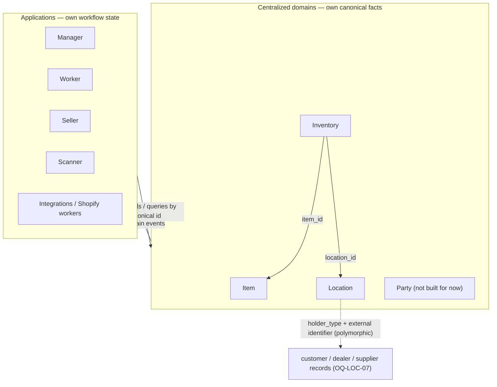

# 07 — Domain Boundaries and Ownership

> **Responsibility:** Explain *why* the boundaries are where they are, who owns which facts, which direction references may point, and the single rule that makes all of it enforceable: **no application writes to a domain's database.**
> **Status:** The boundaries and the data-ownership rule are **established**. **Party is not built for now** (`OQ-LOC-03`): outside holders of stock are locations with a polymorphic link to their record.

## Purpose

Boundaries are not an organisational nicety; they are the mechanism by which the system can enforce rules at all. A rule such as "a property must be legal for the item's classification" can only be enforced if *every* write passes through the code that knows the rule. Every boundary in this architecture exists to make some set of rules enforceable and some set of facts unambiguous.

This document is the reference for the question *"where does this belong?"*

## The four domains and why they are separate

| Domain | Question | Why it is its own boundary |
|---|---|---|
| **Item** | What is this thing? | Facts about the *thing* are stable and shared by everyone. They need one validator (classification, identifiers, versioning). |
| **Inventory** | How much of it exists operationally, and where? | Facts about *quantity and place* change constantly and need a traceable cause. They have different consistency needs, a different change rate, and different writers than item description. Putting `quantity` or `location` on `Item` would make the item record wrong whenever stock moves. |
| **Location** | What location is being referenced? | Location identity must be shared between Inventory and every application. If Inventory defined locations itself, applications would have to go through Inventory to talk about places, and locations would be undefined when there is no stock at them. |
| **Party** | What person / organization is being referenced? | Same argument as Location. People/organizations are referenced by potentially several domains; none of them should own the identity. |

> **CONFIRMED:** Do not collapse these into one service simply because they reference each other.

"Service" here means *bounded responsibility with its own persistence and contract*. Whether the four are deployed as four processes, or as modules of one deployable that still keep separate persistence and only talk through contracts, is a deployment decision for the design session (`OQ-OPS-03`). What is **not** negotiable is that they do not share tables and do not reach into each other's storage.

## Context map



### Reference direction rules

| From → To | Status | Notes |
|---|---|---|
| Inventory → Item (`item_id`) | CONFIRMED | Inventory holds only the ID. |
| Inventory → Location (`location_id`) | CONFIRMED | |
| Location → holder record (`holder_type` + an external identifier) | CONFIRMED | Polymorphic link from a customer / dealer / supplier location to its record. The records stay in their own system; the location stores the kind of holder, the record's id as an external identifier, and name/address snapshots (`OQ-LOC-07`). Replaces the proposed `party_id`. |
| Inventory → Party | NONE | `OQ-INV-08`: Inventory points only at locations; customers, dealers and suppliers are locations. |
| Item → Party | NONE | No Party domain for now. |
| Item → Inventory | **FORBIDDEN** | Item never knows where or how much. |
| Item → Location | **FORBIDDEN** | Same. |
| Location → Inventory / Item | **FORBIDDEN** | Location does not know what is at it. |
| Party → anything | **FORBIDDEN** | Party is a leaf. |
| Any domain → application | **FORBIDDEN** (dependency on app state) / PROPOSED (no direct calls) | Domains never depend on application state. Proposed: they communicate outward only by publishing events, not by calling applications (`INV-INT-07`). |
| Application → domain | CONFIRMED | Via commands, queries and event consumption only. |

A worked consequence of these rules: **item deletion does not check whether Inventory still holds stock**, because `Item → Inventory` is forbidden. That is the boundary doing its job rather than failing. Item stays ignorant of stock, and the cost — a soft-deleted item whose positions outlive it — is paid in reconciliation rather than in a dependency that would make Item unavailable whenever Inventory is. See `INV-ITEM-13` and `OQ-ITEM-10`.

A reference is always **by canonical ID**. A domain never copies another domain's descriptive data into its own canonical state (Inventory does not store the item's name). If it needs such data for validation or display, it keeps a *projection* — the same rule that applies to applications.

## Ownership matrix

| Fact | Item | Inventory | Location | Party | Applications |
|---|:-:|:-:|:-:|:-:|:-:|
| `item_id` | **owns** | refs | | | refs |
| category / item type / properties / dimensions / weight | **owns** | | | | projects |
| `article_number`, `sku` (canonical business identity) | **owns** the guarantee | | | | supply the values |
| external identifiers (Shopify IDs, legacy app IDs, other foreign IDs) | **owns** | | | | supplies / projects |
| classification reference data | **owns** | | | | projects |
| quantity per item per location | | **owns** | | | projects |
| movement history | | **owns** | | | refs by `reference_id` |
| `location_id`, location name/type | | refs | **owns** | | refs / projects |
| `party_id`, party name/kind | | open | refs (proposed) | **owns** | refs / projects |
| workflow state, task state, listing state, UI state | | | | | **owns** |
| local projections of any of the above | | | | | **owns** (as cache) |
| item images (URL references + position and storage information) | **owns** | | | | upload the files, supply the URLs |
| orders, prices | *not assigned in this architecture — see open questions* | | | | |

## The canonical-vs-workflow test

**CONFIRMED principle:** Centralized domains own canonical business facts. Applications own workflow-specific facts.

For every proposed field, ask:

> *"Is this universally true about the business entity, or is this only true inside one application's workflow?"*

Worked examples:

| Candidate field | Universally true? | Verdict |
|---|---|---|
| `item.dimensions` | Yes — the sofa is 220 cm wide regardless of who asks. | Canonical (Item) |
| `item.category` | Yes. | Canonical (Item) |
| `item.identifiers` | Yes — the Shopify variant ID is a fact about how Shopify refers to the item. | Canonical (Item) |
| `item.images` | Yes — what the thing looks like is true of the thing itself. | Canonical (Item) |
| `item.name` | Universally true, but **valueless** — classification and properties already say what the thing is, and free text adds nothing enforceable. | **Not modelled** (`OQ-ITEM-02` resolved). A model name, if ever needed, becomes a property. |
| `item.quantity_on_hand` | It is a fact, but about *stock*, not about *the thing*. | Canonical, but **Inventory** |
| `item.location` | Same. | **Inventory** |
| `awaiting_photography` | No — it describes the Worker app's process. | Application (Worker) |
| `photo_approved_for_listing` | No — describes a review process, not the photo. | Application (Seller) |
| `listing_state = draft` | No — describes the Seller/Shopify process. | Application (Seller) |
| `selected_for_campaign` | No. | Application |
| `currently_being_reviewed` | No. | Application |
| `assigned_to_user` | No. | Application |
| `condition = damaged` | Ambiguous: is it a fact about the physical unit (Item? Inventory?) or a workflow flag? | **Open** (`OQ-INV-05`) — do not assume |

Note what `item.name` demonstrates: passing the "universally true" test is **necessary but not sufficient**. A fact can be true of the item and still not belong in the canonical model, if it carries no meaning the domain can validate and nothing depends on it. *"Is it true?"* and *"is it worth modelling?"* are two separate questions.

A second useful test, for fields that *are* universally true:

> *"Does this fact change when the thing is moved, counted, sold or returned?"*
> If yes → Inventory. If no → Item.

## Data ownership — the enforcement rule

**CONFIRMED:** Applications must **not** directly modify the databases owned by centralized domains.

```
FORBIDDEN                                   REQUIRED

Manager App ─┐                              Manager App ─┐
Worker App  ─┼──> Item Database             Worker App  ─┤
Seller App  ─┘                              Seller App  ─┼──> Item API ──> Item Database
                                            Scanner App ─┤
                                            Integrations ┘
```

The Item Domain (and each other domain) owns its persistence. **All writes pass through its domain/API boundary.** This is what makes the following enforceable in one place:

- validation
- authorization
- classification rules
- property rules
- identifier uniqueness
- concurrency / versioning
- auditability
- domain invariants

If even one application writes directly, none of these can be trusted, because the domain can no longer assume its own invariants hold.

**PROPOSED extension:** direct *reads* of a domain's database by applications are also prohibited (`INV-INT-06`, `OQ-API-05`). Direct reads couple applications to the domain's internal schema, which then cannot evolve. Applications read through queries or through their own event-fed projections. Reporting/analytics access is a separate concern to be decided.

## What "ownership" implies for each party

| Owner | Must | Must not |
|---|---|---|
| **Domain** | Validate every command; enforce invariants; version entities; publish events for every committed change; keep its schema private. | Store workflow state; call applications; depend on application data; expose its tables. |
| **Application** | Reference canonical entities by canonical ID; send changes as commands; consume events idempotently; treat projections as caches. | Write to domain storage; read domain tables; treat its projection as truth; store canonical facts as if it owned them. |

## Reference data ownership

`Category`, `ItemType`, `PropertyDefinition` are owned by the **Item Domain**. Locations' type vocabulary by **Location**. Movement types by **Inventory**. *Governance*: the Item vocabulary may be changed by any application or user, with every change recorded in the polymorphic history table (`OQ-CLS-02`); for location and movement types it is open (`OQ-LOC-05`, `OQ-AUTHZ-03`), but ownership is not: the vocabulary lives in the domain, is changed through its API, and is published to applications, never the other way around.

## Established Decisions

- Four separate bounded responsibilities: Item, Inventory, Location, Party.
- They are not collapsed into one; they share no persistence.
- Inventory references Item and Location by canonical ID; Item never references Inventory or Location.
- Applications own workflow-specific facts; domains own canonical facts.
- Applications never write to domain-owned databases; all writes go through the domain API.
- Domains never depend on application state. (That they also never *call* applications is proposed, not established.)

## Open Questions

- `OQ-LOC-08` — Which location types count as "we have it".
- `OQ-API-05` — Direct read access to domain databases (proposed: prohibited).
- `OQ-OPS-03` — Deployment topology (separate processes vs modular deployable with separate persistence).
- `OQ-INV-05` — Where "condition" of a physical unit belongs.
- Orders and prices are referenced by applications but assigned to no domain here (see the out-of-scope note in [01](01-item-domain.md#does-not-own)).
- Images **are** canonical and owned by Item (`OQ-ITEM-08` resolved), but the image *files* live in application or third-party storage — the one place where canonical state depends on infrastructure no domain controls (`OQ-IMG-04`).
