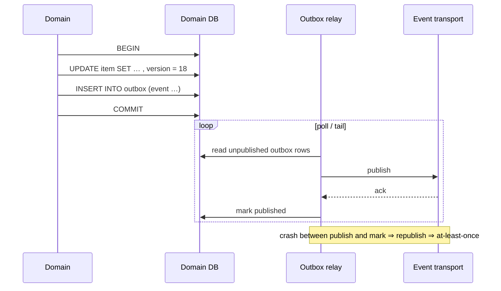

# 08 — Commands, Queries and Events

> **Responsibility:** Define how state enters a domain (commands), how it is read (queries), and how changes leave it (events) — and the reliability guarantees around them.
> **Status:** The pipeline shape, outbox and at-least-once semantics are **established**. Command granularity, event taxonomy, payload shape, ordering and transport are **open**.

## Purpose

The domains are only trustworthy if there is exactly one way to change them and a reliable way to learn that they changed. This document fixes that shape:

```
Application
    ↓
Command / API
    ↓
Domain validation
    ↓
Transaction
    ↓
Canonical state change
    ↓
Transactional outbox
    ↓
Domain event
    ↓
Consumers
```

Each stage has a reason to exist:

| Stage | Why |
|---|---|
| **Command / API** | Single entry point; expresses *intent* ("add identifier", "transfer stock"), not a raw data patch. |
| **Domain validation** | Authorization, invariants, classification rules, identifier rules, expected version — all checked before anything changes. |
| **Transaction** | State change and outbox record are committed atomically, or neither is. |
| **Canonical state change** | The only place canonical facts change. Version increments. |
| **Transactional outbox** | Guarantees an event is published *if and only if* the change committed. Avoids the dual-write problem (DB committed but publish failed, or vice versa). |
| **Domain event** | Tells the rest of the system a fact changed, so it can react without polling or sharing a database. |
| **Consumers** | Applications' projections, integrations, other domains. |

## Commands

### Nature of a command

A command is a request to change canonical state, expressed as **business intent**. It is not a generic `PATCH item SET <anything>`. This matters because:

- intent can be validated ("is this property legal for this item?"), a raw patch cannot;
- intent can be authorized per operation ("Scanner may `transfer` but not `adjust`");
- intent maps to a meaningful event.

**CONFIRMED:** Commands carry, where applicable:

- the target canonical ID;
- the **expected version** of the target (optimistic concurrency, [09](09-versioning-concurrency-and-idempotency.md));
- an **idempotency key** so retries do not duplicate operations;
- the **acting application** (and, where relevant, the acting user — `OQ-AUTHZ-02`) for authorization and audit.

### Command handling

**PROPOSED:** Commands are handled **synchronously** — the caller receives the outcome (new version, or a validation/conflict error) in the response. This is the simplest model and matches the version-conflict semantics in the brief (the caller must know immediately that its expected version was stale). Asynchronous command acceptance is not ruled out for bulk operations (`OQ-API-01`, `OQ-API-03`).

### Outcomes

| Outcome | Meaning |
|---|---|
| **Success** | State changed; response includes the new `version`. |
| **Idempotent replay** | Same idempotency key seen before; original outcome returned; no new change. |
| **Validation error** | Command violates a rule (illegal property, unknown item type, bad value). No change. |
| **Version conflict** | `expected_version` ≠ current version. No change. Caller must re-read. |
| **Authorization error** | Caller may not issue this command. No change. |
| **Not found** | Target does not exist. |

Exact error contract is for the design session (`OQ-API-06`).

### Initial command inventory (conceptual)

| Domain | Commands |
|---|---|
| Item | `CreateItem`, `ClassifyItem`, `UpdateItemDimensions` / `UpdateItemWeight` (or `UpdateItem`), `SetItemProperty`, `RemoveItemProperty`, `AddItemIdentifier`, `RemoveItemIdentifier`; reference-data commands; lifecycle commands (open). |
| Inventory | `receive`, `transfer`, `place`, `remove`, `sell`, `return`, `adjust` (semantics open). |
| Location | `CreateLocation`, `RenameLocation`, `RetireLocation` (minimal). |
| Party | `CreateParty`, `RenameParty` (minimal). |

Granularity — many fine-grained commands vs. one coarse `UpdateItem` carrying a partial document — is **open** (`OQ-API-02`). The trade-off: fine-grained commands map cleanly to events and authorization; coarse commands are simpler for form-based applications that edit many fields at once. Both can be offered; the decision affects the event taxonomy (`OQ-EVT-01`).

## Queries

### Nature of a query

A query reads canonical state without changing it. Queries are served by the domain from its own persistence (or a domain-owned read model), never by applications reading domain tables.

### Initial query inventory (conceptual)

| Domain | Queries |
|---|---|
| Item | Get item by id (full state incl. version); **resolve identifier → item_id**; list identifiers; get classification vocabulary; allowed property definitions for a type; search/filter (capabilities open, `OQ-API-04`); batch get. |
| Inventory | Positions by item; positions by location; movement history; total per item. |
| Location | Get by id; list; resolve location code (open). |
| Party | Get by id; search by name. |

### Query vs projection

Applications have two ways to read canonical data:

| Way | When appropriate |
|---|---|
| **Query the domain API** | Need the latest committed state (e.g. before issuing a command, to obtain the current version); low volume; acceptable latency; acceptable coupling to domain availability. |
| **Read own projection** | High-volume reads, list views, offline/edge cases (Scanner), decoupling from domain availability. Projection may lag. |

Which paths each application uses on its hot path is open (`OQ-APP-02`); freshness requirements are open (`OQ-APP-01`).

## Events

### Nature of an event

A domain event is a **fact that something already happened** to canonical state. It is named in past tense, carries the canonical ID and the **resulting version**, and is published only after the change is committed.

Events are not commands in disguise: a domain never publishes "please do X" to applications.

### Initial event taxonomy (examples, not final — `OQ-EVT-01`)

From the brief, for Item:

| Event | Cause |
|---|---|
| `ItemCreated` | `CreateItem` |
| `ItemUpdated` | Physical description / first-class attribute change |
| `ItemIdentifierAdded` | `AddItemIdentifier` |
| `ItemIdentifierRemoved` | `RemoveItemIdentifier` |
| `ItemClassificationChanged` | `ClassifyItem` |
| `ItemPropertyChanged` | `SetItemProperty` / `RemoveItemProperty` |

Proposed for other domains (not in the brief): `InventoryMovementRecorded`, `InventoryPositionChanged`, `LocationCreated/Changed/Retired`, `PartyCreated/Changed`, and reference-data events (`CategoryCreated`, `PropertyDefined`, …).

Note the overlap between `ItemUpdated` and the fine-grained events. Two coherent options exist: (a) fine-grained events only, with `ItemUpdated` reserved for first-class attributes; (b) a single `ItemChanged` snapshot event plus optional fine-grained events. Choosing is `OQ-EVT-01`/`OQ-EVT-02`.

### Event envelope (proposed minimum)

```
event_id            ← unique per event; consumers may dedupe on it
event_type          ← e.g. ItemPropertyChanged
occurred_at
aggregate_type      ← Item | InventoryMovement | Location | Party
aggregate_id        ← e.g. itm_123
aggregate_version   ← version after this change (for ordering and idempotent apply)
causation           ← command / idempotency key that caused it (for audit; content open)
payload             ← delta or snapshot (OQ-EVT-02)
schema_version      ← (OQ-EVT-06)
```

### Delivery guarantees

| Guarantee | Status |
|---|---|
| Events are published only for committed changes | **CONFIRMED** (transactional outbox) |
| Every committed change produces its event(s) eventually | **CONFIRMED** (outbox is durable and retried) |
| **At-least-once** delivery — a consumer may see the same event more than once | **CONFIRMED** — consumers must be idempotent |
| Per-aggregate ordering (events for `itm_123` arrive in version order) | **PROPOSED** (`OQ-EVT-03`). Without it, consumers must rely on `aggregate_version` to discard stale events. |
| Global ordering across aggregates | **Not promised.** |
| Exactly-once delivery | **Not promised.** Do not design consumers that need it. |
| Replay / backfill for new consumers | **OPEN** (`OQ-EVT-05`). A new projection needs a way to reach the current state; options include event replay from a retained log or an initial bulk load via queries. |

### Transactional outbox — how it works (conceptual)



The relay mechanism (polling, CDC, etc.) and the transport are technology choices for the design session (`OQ-EVT-04`).

## Consumers and projections

**CONFIRMED:**

- Applications may maintain **local projections** of canonical information they need for their workflows.
- The domain remains authoritative; projections are read models / caches, not independent authorities.
- Consumers must assume at-least-once delivery and be **idempotent**.

Example projection (Worker app), from the brief:

```json
{
    "item_id": "itm_123",
    "article_number": "A-4932",
    "name": "Stockholm Sofa",
    "category": "Furniture",
    "version": 17
}
```

**PROPOSED consumer rule:** when an event for `aggregate_id` with `aggregate_version = n` arrives, apply it only if the projection's stored version `< n`; otherwise ignore it. With per-aggregate ordering this is sufficient; without it, delta events for version `n` arriving after version `n+1` must be dropped, which only works if consumers can reconstruct state — another reason `OQ-EVT-02` (delta vs snapshot) matters.

See [10-application-integration.md](10-application-integration.md) for per-application guidance.

## Example Flow — end to end

1. Seller app wants to attach a new Shopify variant ID to `itm_123` (currently version 18).
2. Seller sends `AddItemIdentifier { item_id: itm_123, expected_version: 18, namespace: shopify, identifier_type: variant_id, value: "999", idempotency_key: "seller-op-4471" }`.
3. Item Domain: authorizes Seller; checks uniqueness rule (open); checks version 18 == 18; in one transaction writes the identifier, sets version 19, inserts `ItemIdentifierAdded { aggregate_id: itm_123, aggregate_version: 19, … }` into the outbox; commits.
4. Response to Seller: `{ version: 19 }`.
5. Seller's network drops before the response arrives; Seller retries with the same idempotency key → domain returns the stored outcome `{ version: 19 }`; nothing changes.
6. Outbox relay publishes the event. Shopify integration worker receives it, updates its mapping. It receives it a second time → its projection is already at version 19 → ignored.

## Failure / Conflict Cases

| Case | Behaviour |
|---|---|
| DB commit succeeds, relay crashes before publishing | Event remains in outbox; published on next relay cycle. No loss. |
| Relay publishes, crashes before marking | Event republished. Consumer dedupes. |
| Consumer crashes mid-apply | Redelivered; consumer's apply must be atomic + idempotent. |
| Consumer receives events out of order (if ordering not guaranteed) | Uses `aggregate_version` to skip stale; needs snapshot or re-query to fill gaps. |
| Command retried with same idempotency key but *different* payload | Should be rejected as a misuse (proposed) — see [09](09-versioning-concurrency-and-idempotency.md). |
| Poison event (consumer cannot process) | Needs dead-lettering / alerting — operational concern (`OQ-OPS-04`). |

## Established Decisions

- The command → validation → transaction → canonical change → outbox → event → consumer pipeline.
- Commands express intent and pass through domain validation; there is no raw-patch escape hatch.
- Domain events are published via a transactional outbox after committed changes.
- Delivery is at-least-once; consumers must be idempotent.
- Applications may hold local projections; the domain remains authoritative.
- The initial Item event names are examples, not the final taxonomy.

## Open Questions

See [12-open-questions.md — API](12-open-questions.md#api) and [— Events](12-open-questions.md#events).

- `OQ-API-01` — Sync vs async command handling; protocol.
- `OQ-API-02` — Command granularity.
- `OQ-API-03` — Bulk / batch operations.
- `OQ-API-04` — Query and search capabilities.
- `OQ-API-06` — Error contract.
- `OQ-EVT-01` — Final event taxonomy (coarse vs fine).
- `OQ-EVT-02` — Payload: delta vs snapshot.
- `OQ-EVT-03` — Per-aggregate ordering guarantee.
- `OQ-EVT-04` — Transport / relay technology.
- `OQ-EVT-05` — Replay / backfill for new consumers.
- `OQ-EVT-06` — Event schema versioning.
- `OQ-EVT-07` — Retention.
