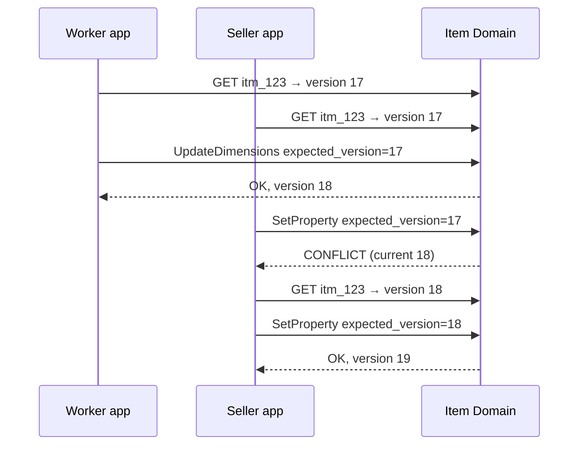

# 09 — Versioning, Concurrency and Idempotency

> **Responsibility:** Prevent applications from silently overwriting newer canonical information, and prevent retries from duplicating operations.
> **Status:** Optimistic concurrency via entity version is **established**. Whether the expected version is mandatory, what bumps the version, and the exact idempotency contract are **open**.

## Purpose

Several applications and integrations will change the same canonical entities. Two problems follow:

1. **Lost updates.** The Worker app reads item version 17, the Seller app reads version 17, both write. Without protection the second write silently discards the first.
2. **Duplicated operations.** A network timeout makes an application retry `receive(1 sofa)`. Without protection the domain records two sofas.

The brief fixes the mechanism for both: **versioned entities with optimistic concurrency**, and **idempotent commands**.

## Versioning

### Model

**CONFIRMED:** Canonical entities carry a `version`.

```json
{ "id": "itm_123", "version": 17 }
```

- The version is a monotonically increasing integer per entity.
- Every committed change to the entity increments it by exactly one (proposed: by one; the brief shows 17 → 18).
- The version is returned by every query and every successful command, and is carried on every event as `aggregate_version`.

### Optimistic concurrency

**CONFIRMED:** An update can state the version it expects.

```
If current version == expected version:
    apply update
    version becomes expected + 1
Else:
    reject as conflict — the update was based on stale information
```

Example from the brief: an update expecting 17 succeeds when current is 17 (becoming 18); the same update arriving when current is already 18 conflicts.



On conflict the caller must **re-read and decide** — retry against the new version if its change is still valid, or surface the conflict to a user. The domain never merges automatically.

### What has a version

| Entity | Versioned? |
|---|---|
| `Item` (aggregate root) | **CONFIRMED** |
| `ItemIdentifier`, `ItemProperty`, `ItemImage` | **CONFIRMED:** not independently versioned; changes to them increment the owning item's version (`OQ-ITEM-05` resolved). |
| `Category`, `ItemType`, `PropertyDefinition` | **PROPOSED:** versioned as reference-data entities. |
| `InventoryPosition` | **OPEN:** per-position version, per-item version, or database serialization (see [04](04-inventory-domain.md)). |
| `InventoryMovement` | Immutable — no version needed. |
| `Location`, `Party` | **PROPOSED:** versioned. |

### Aggregate boundary — **RESOLVED** (`OQ-ITEM-05`)

**Identifier, property and image changes all increment `item.version`.** That is what the version is for: it tracks the item's canonical state as a whole, so a change to any part of it is a change to the item.

The cost is accepted deliberately:

- **What we get:** one version guards the whole item. A form editing properties and dimensions together is safe, the "is this property legal for this classification?" check cannot race a concurrent reclassification, and consumers can order every item event by a single number.
- **What we pay:** two applications editing *different* parts of the same item will conflict. A Shopify worker adding an identifier can invalidate a Worker's pending dimension edit. A Worker uploading eight photographs produces eight version bumps.

The second is the point, not a defect — the alternative is silent divergence, which is what this architecture exists to prevent. Two practical consequences follow:

1. **Applications need a re-read-and-retry path**, not a one-shot write. A conflict is an expected outcome on a busy item, not an exceptional error.
2. **Command granularity now matters more** (`OQ-API-02`). A coarse `UpdateItem` that saves a whole form is one version bump; the equivalent fine-grained commands are many, each a fresh chance to conflict.
### Is `expected_version` mandatory? (`OQ-CC-01`)

Options:

| Option | Effect |
|---|---|
| Mandatory on every update | Strongest protection; every caller must read before writing. |
| Optional ("last writer wins" if omitted) | Convenient for integrations that only ever *add* (e.g. add an identifier) but weakens the guarantee. |
| Mandatory for updates, optional for pure additions | Middle ground; requires defining which commands are "pure additions". |

Open. The brief says "an update *can* state that it expects version 17", which does not settle it.

## Idempotency

### Commands

**CONFIRMED:** Commands should support idempotency where appropriate so retries do not accidentally duplicate operations.

**PROPOSED contract:**

- The caller supplies an **idempotency key** unique to the logical operation (not to the HTTP attempt).
- The domain stores the key with the outcome (success + resulting version, or the error) for a retention window.
- A repeated key returns the **stored outcome** without re-executing.
- A repeated key with a **different payload** is rejected as a misuse (proposed), because silently returning the old outcome would hide a bug in the caller.
- Scope of the key: per calling application (proposed), so two applications cannot collide.

Where the key comes from is application-specific: a Worker task ID, a scan session + sequence number, a Shopify webhook ID. For Inventory, `source_application + reference_id` is a natural candidate (`OQ-INV-07`).

Idempotency and versioning interact: a retried command that originally succeeded returns the original success even though the current version has since moved on. This is correct — the operation *did* happen once.

### Which operations need idempotency?

| Operation kind | Need |
|---|---|
| Creations (`CreateItem`, `receive`) | **High** — a retry would create a duplicate entity/movement with no version to protect it. |
| Movements (`transfer`, `sell`, …) | **High** — same. |
| Updates with `expected_version` | Lower — a retry of an already-applied update fails on version conflict, which is safe but confusing; an idempotency key gives a clean "already done" answer instead. |
| Additions that are naturally idempotent (`AddItemIdentifier` of an already-present triple) | Can be made idempotent by semantics (no-op), but an explicit key is still cleaner. |

### Consumers

**CONFIRMED:** Event delivery is at-least-once; consumers must be idempotent.

**PROPOSED consumer contract:**

- Dedupe on `event_id`, **and/or**
- apply only if `aggregate_version` > the version the consumer has stored for that aggregate.

The second is preferred because it also handles reordering and does not require unbounded storage of seen event IDs. See [08](08-commands-queries-and-events.md#consumers-and-projections).

## Auditability

Versions give a change count; they do not say *who* changed *what* and *why*. **PROPOSED:** every committed change records the acting application (and user where relevant, `OQ-AUTHZ-02`), the command/idempotency key, and the timestamp — either as an explicit audit record or as the event log itself. Retention and query requirements for audit are open (`OQ-OPS-01`).

## Example Flow — retry

1. Scanner app sends `transfer { item_id: itm_123, from: loc_inbound, to: loc_B2, quantity: 1, idempotency_key: "scanner-s91-007" }`.
2. Inventory records the movement and responds; the response is lost in transit.
3. Scanner retries with the same key.
4. Inventory finds `scanner-s91-007`, returns the original success. Position remains `(itm_123, loc_B2) = 1`, not 2.

## Failure / Conflict Cases

| Case | Behaviour |
|---|---|
| `expected_version` stale | Conflict; no change; caller re-reads. |
| `expected_version` omitted | Depends on `OQ-CC-01`. |
| Same idempotency key, same payload | Stored outcome returned. |
| Same idempotency key, different payload | Rejected (proposed). |
| Idempotency key expired from retention, then retried | Re-executed — may duplicate. Retention window must exceed the longest plausible retry horizon. |
| Version overflow / reset | Not a practical concern with integers; versions never reset. |
| Consumer stores version but crashes before committing projection | Must apply + store version atomically; otherwise it will skip the event on redelivery. |

## Established Decisions

- Canonical entities have a version.
- Updates may state an expected version; a mismatch is rejected rather than overwriting newer information.
- Commands support idempotency so retries do not duplicate operations.
- Event consumers are idempotent because delivery is at-least-once.
- Exact API semantics are still to be designed.

## Open Questions

- `OQ-ITEM-05` — What is inside the item version boundary.
- `OQ-CC-01` — Is `expected_version` mandatory, optional, or command-dependent?
- `OQ-CC-02` — Idempotency key scope, retention window, behaviour on payload mismatch.
- `OQ-CC-03` — Concurrency mechanism for Inventory positions.
- `OQ-OPS-01` — Audit requirements.
- `OQ-AUTHZ-02` — Actor identity (application vs user) on commands.
