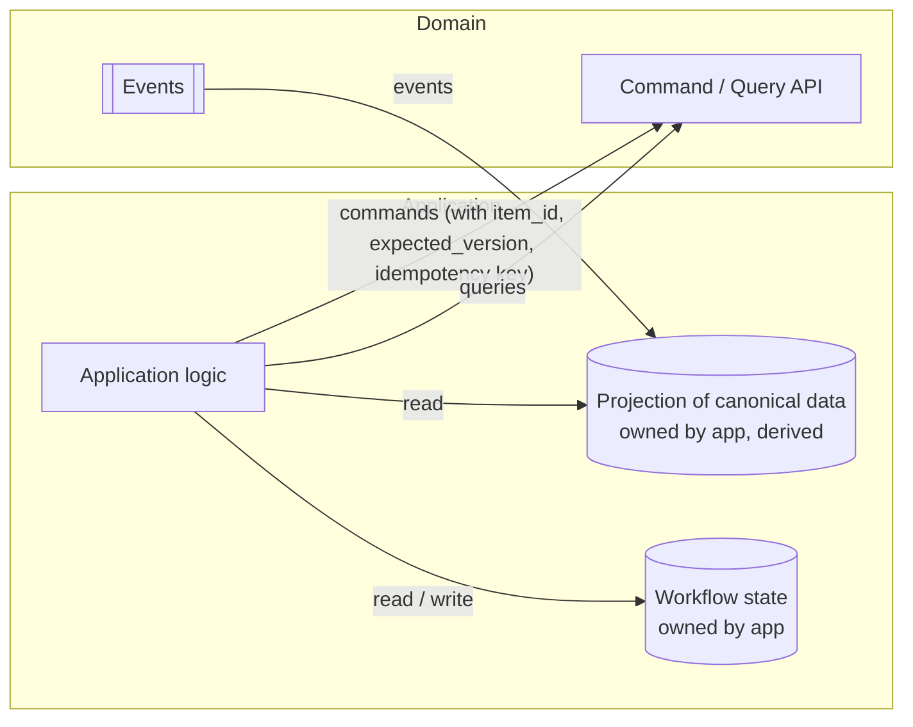

# 10 — Application Integration

> **Responsibility:** Describe how the existing applications relate to the centralized domains: what they send, what they read, what they keep, and what they must stop doing.
> **Status:** Integration pattern is **established**. Per-application command sets, projection freshness and migration approach are **open**.

## Purpose

The centralized domains only deliver value if the applications actually use them as the authority. This document describes the integration contract from the **application's** point of view, so that each application team knows what changes for them and what does not.

## The integration pattern (applies to every application)



An application:

1. **References** canonical entities by canonical ID (`item_id`, `location_id`, `party_id`) in its own records.
2. **Sends commands** to a domain when its workflow reaches a step that changes a canonical fact.
3. **Queries** the domain when it needs the latest state (e.g. current version before a command).
4. **Consumes events** to keep a local **projection** of the canonical data it needs for display and workflow decisions.
5. **Owns its workflow state** in its own database, keyed by the canonical ID.

An application never:

- writes to a domain database;
- reads a domain database directly (proposed, `OQ-API-05`);
- treats its projection as the truth when it conflicts with the domain;
- stores a canonical fact as if it owned it (e.g. maintaining its own "real" dimensions that differ from the domain's);
- puts workflow state into a domain.

## Per-application view

The following is **illustrative** — it describes plausible roles based on the application names in the brief. Which commands each application actually issues is `OQ-APP-04`. For now every registered application is *allowed* to issue every command (`OQ-AUTHZ-01`).

| Application | Likely reads | Likely commands | Keeps for itself |
|---|---|---|---|
| **Manager** | Everything: items, identifiers, classification vocabulary, inventory positions and history, locations, parties. | Item creation and correction; reference-data management (if Manager is the governance UI — open); `adjust`; location/party creation. | Management workflows, review states, approvals. |
| **Worker** | Items assigned to its tasks (projection: article number, category, identifiers, dimensions, images, version); allowed property definitions for forms. | `UpdateItemDimensions`, `SetItemProperty`, possibly `receive`/`place`/`transfer`. | `workflow_state` (e.g. `awaiting_photography`), task assignment, photo-session state. |
| **Seller** | Item projection for listing preparation; identifiers (Shopify IDs); total availability from Inventory. | `AddItemIdentifier` (Shopify IDs, if Seller creates listings); possibly property edits. | `listing_state` (`draft`, `published`), channel-specific copy, campaign selections. |
| **Scanner** | Identifier → `item_id` resolution; location resolution; positions at a location. | `transfer`, `place`, possibly `receive`. | Scan sessions, offline queue, device state. |
| **Shopify / integration workers** | Identifier resolution; item projection for sync; availability. | `AddItemIdentifier`, `sell`, `return`; possibly property or image updates if Shopify is a source (open, `OQ-MIG-04`). | Sync cursors, webhook dedup state, per-channel mapping. |

> **Shopify app proxy.** Shopify reaches the domains through a Shopify app proxy — a central system acting on behalf of the shops. Each shop is its own external application with its own source registration and API key, stored in the proxy and used for every request made for that shop (`OQ-ID-05`).


## Projections

**CONFIRMED:** Applications may maintain local projections of canonical information; the domain remains authoritative; projections are caches.

Example (Worker), from the brief:

```json
{
    "item_id": "itm_123",
    "article_number": "A-4932",
    "category": "Furniture",
    "version": 17
}
```

Observations about this example that the design session must resolve:

- `article_number` is a **canonical attribute** of the item, so the projection simply copies a field. (Had it been an external identifier, the projection would have needed a rule for choosing *which* identifier to flatten — that problem does not arise for canonical business identity.)
- There is **no** `name`: the projection caches `article_number` and `category`, which is what the app actually displays. Anything more descriptive comes from properties or images (`OQ-ITEM-02` resolved; what apps display is `OQ-ITEM-09`).
- `category` is a name, not an ID — the projection resolved the reference-data ID to a display name, so it must also consume reference-data events (or re-query) when categories are renamed.
- `version` is the item version at the time of the last applied event — this is what makes idempotent application possible.

**PROPOSED projection rules:**

1. Store the `aggregate_version` last applied per canonical ID; ignore events with version ≤ stored.
2. Apply an event and store its version atomically.
3. Bootstrap a new projection by bulk query or replay (`OQ-EVT-05`); do not assume events from the beginning of time are available.
4. When a projection and the domain disagree, the projection is wrong; re-query and overwrite.
5. Never write back from a projection to the domain "to fix" it.

## Identifier resolution and migration (outline only)

Each application currently holds its own item identifiers — some are our own article numbers and SKUs (which become canonical attributes), others are that application's internal surrogate keys (which become external identifiers). The identifier model in [02](02-canonical-identity-and-identifiers.md) is designed so that migration can be **incremental**:

```
Phase 0 (today)        App record { local_id: 4711, article: "A-4932", … }
Phase 1 (bridge)       Item Domain has itm_123 with
                           article_number = "A-4932"            ← canonical attribute
                           sku            = "SOFA-STO-3L"       ← canonical attribute
                           external identifier legacy_<app>/item_id/4711   (namespace names illustrative)
                       App resolves 4711 → itm_123 on demand and stores item_id alongside
Phase 2 (converged)    App records carry item_id; local canonical fields become projection fields
Phase 3 (retired)      App stops writing canonical fields; legacy identifiers remain for history
```

What is **not** decided (`OQ-MIG-*`):

- which application's data seeds the Item Domain and how conflicts between applications' versions of the same item are resolved;
- how duplicates across applications are detected and merged;
- whether there is a dual-write period, and if so who is authoritative during it;
- Shopify's role: source, consumer or both.

None of this should be improvised during implementation.

## Anti-patterns to reject in review

| Anti-pattern | Why it is wrong | Correct form |
|---|---|---|
| App writes to `item` table directly | Bypasses validation, versioning, events. | Send a command. |
| App reads `item` table directly | Couples app to domain schema. | Query API or projection. |
| `item.status = awaiting_photography` | Workflow state in canonical model. | Keep in Worker's own table keyed by `item_id`. |
| App stores `shopify_variant_id` as its foreign key to "the item" | Competing canonical identity. | Store `item_id`; resolve Shopify ID via Item Domain. |
| App keeps its own `dimensions` that differ from the domain's "because ours are right" | Two authorities. | Send `UpdateItemDimensions`; if rejected, the rejection is the signal. |
| App consumer applies every event unconditionally | Breaks under redelivery/reordering. | Version-gated idempotent apply. |
| App sends `PATCH quantity = 17` to Inventory | No traceable cause. | Use a movement command with a reason. |
| Domain calls an application's API to "notify" it | Inverts dependency direction. | Domain publishes an event; application subscribes. |

## Example Flow — Worker app end to end

1. **Event in:** Worker receives `ItemCreated { itm_123, version 1, … }` → creates projection row and *its own* workflow row `{ item_id: itm_123, workflow_state: awaiting_measurement }`.
2. **Work:** worker measures the sofa in the UI.
3. **Command out:** `UpdateItemDimensions { itm_123, expected_version: 1, … , idempotency_key: task-88 }` → response `version 2`.
4. **Own state:** Worker sets `workflow_state = awaiting_photography`. The domain is not involved.
5. **Event in:** `ItemUpdated { itm_123, version 2 }` arrives → projection updated (or already at 2 if Worker optimistically applied its own change; either way idempotent).
6. **Event in (duplicate):** same event again → version 2 ≤ 2 → ignored.

## Established Decisions

- Applications reference canonical entities by canonical ID and retain ownership of their workflow state.
- All writes go through domain APIs; no direct database access.
- Applications may hold projections fed by events; projections are caches, not authorities.
- Consumers are idempotent under at-least-once delivery.
- Existing identifiers are bridged via `ItemIdentifier` so migration can be incremental.

## Open Questions

See [12-open-questions.md — Application integration](12-open-questions.md#application-integration) and [— Migration](12-open-questions.md#migration).

- `OQ-APP-01` — Projection freshness / read-your-own-writes needs per application.
- `OQ-APP-02` — Query API vs projection on hot paths.
- `OQ-APP-03` — Scanner offline / latency constraints for identifier resolution.
- `OQ-APP-04` — Which application(s) create items.
- `OQ-MIG-01` … `OQ-MIG-03` — Seeding, duplicate reconciliation, cut-over.
- `OQ-MIG-04` — **Resolved:** Shopify, like every connected app, both supplies and consumes item facts; the Item Domain is the only authority.
- `OQ-AUTHZ-01` — **Resolved (for now):** apps authenticate with API keys (tracked in a key table); no per-app permissions yet — every app may do everything. A permission layer comes later.
