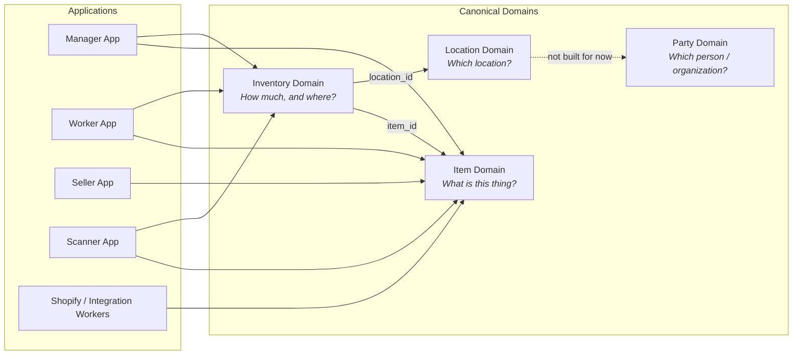
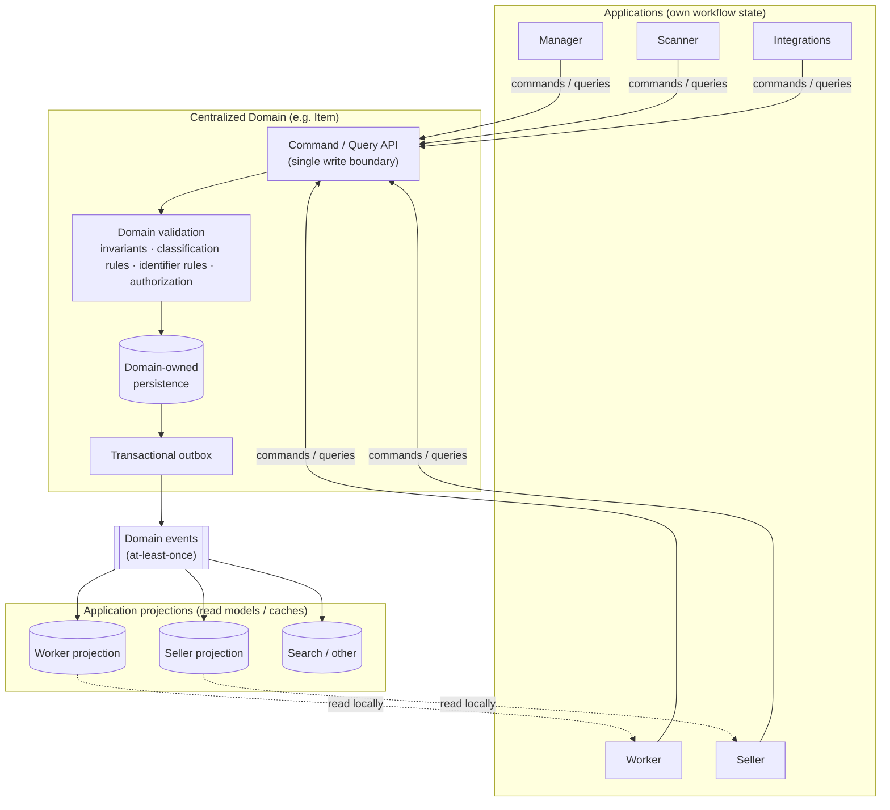
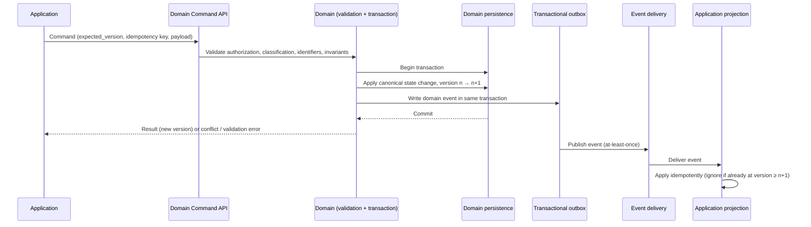

# Centralized Business Domains — Item Domain Architecture

**Status:** Initial architecture. Domain boundaries are established; concrete API, schema, event contracts and technology choices are **not** yet designed.
**Audience:** A developer who will design and implement the Item Domain (and its neighbouring domains) and who knows nothing about this project yet.

This README is the entry point. It explains *why* the architecture exists, *what* the domains are, *who owns what*, and *where to read next*. The detailed documents are linked at the bottom.

---

## 1. Why this architecture exists

We run several business applications that were built independently over time:

- **Manager application**
- **Worker application**
- **Seller application**
- **Scanner application**
- **Shopify / integration workers**
- potentially additional applications later

Each of these applications has grown its **own representation of shared business concepts** — most importantly, *what an item is*. The same physical thing may be described in the Manager app, the Worker app, the Seller app and in Shopify, each with its own record, its own identifier, and its own idea of what the "truth" is.

This causes recurring problems:

| Problem | Consequence |
|---|---|
| No single authoritative record of an item | Applications disagree about basic facts (category, dimensions, name). |
| No single authority for our own article numbers and SKUs, plus foreign IDs (Shopify, legacy systems, suppliers) scattered across applications | Joining data across applications is fragile and manual. |
| Every application defines its own "location" and "person/organization" | The same warehouse or supplier exists many times with different identities. |
| Applications write directly to each other's databases | Validation, authorization and auditing cannot be enforced consistently. |
| Workflow state and business facts are mixed in the same records | "Awaiting photography" ends up looking like a property of a sofa. |

We are introducing **centralized business domains** that become the **authoritative source** for shared business concepts. Applications keep owning their own workflows, but they refer to shared concepts via canonical identities instead of inventing their own.

The **Item Domain** is one of the first centralized domains and the primary subject of this documentation package.

---

## 2. The business problem being solved

In one sentence:

> Every application needs to agree on **what an item is**, **how much of it we have and where**, **which location is meant**, and **which person or organization is meant** — without each application maintaining a private, diverging copy of those facts.

Concretely, the architecture must make it possible to:

1. Give every item a **single stable canonical identity** (`item_id`) that all applications reference, and make our own business identifiers (`article_number`, `sku`) genuinely unique by giving them one authority.
2. Let existing applications **resolve their existing foreign identifiers** (Shopify IDs, legacy system IDs, other foreign IDs) to that canonical identity *without* forcing an immediate big-bang migration.
3. Keep canonical facts (classification, dimensions, properties) **validated and consistent**, because they are written through one boundary.
4. Keep application workflow state (photography queue, listing draft, review status) **out** of the canonical model, so the canonical model stays stable while workflows change.
5. Let applications **react to canonical changes** through events and maintain their own local read models.

---

## 3. Canonical business domains — the concept

A **canonical business domain** is a component that is the *single authority* for one category of business facts. It:

- owns the **persistence** of those facts (its own database, not shared);
- exposes those facts only through **its own API/contract** (commands, queries, events);
- enforces **validation, invariants, authorization, versioning and auditability** at that boundary;
- publishes **domain events** when canonical state changes so other systems can react.

The rule that drives every design decision:

> **Centralized domains own canonical business facts. Applications own workflow-specific facts.**

For every proposed field, ask:

> *"Is this universally true about the business entity, or is this only true inside one application's workflow?"*

If it is only true inside one workflow, it does **not** belong in a centralized domain.

| Canonical (belongs in a domain) | Application-specific (stays in the application) |
|---|---|
| item dimensions and weight (universal) + properties (conditional on type) | `awaiting_photography` |
| item dimensions | `selected_for_campaign` |
| item category / item type | `currently_being_reviewed` |
| item identity (`item_id`, `article_number`, `sku`) and external identifiers (Shopify variant ID, …) | listing draft state |
| item images (what the thing looks like) | photo review / retouching state |
| inventory quantity at a location | UI state, task state, assignment state |

---

## 4. The four current domains

| Domain | Question it answers | Maturity |
|---|---|---|
| **Item** | *"What is this thing?"* | Primary focus of this package; conceptual model defined, schema not finalized. |
| **Inventory** | *"How much of it exists operationally, and where?"* | Initial design; operations proposed, rules unresolved. |
| **Location** | *"What location is being referenced?"* | Deliberately minimal; identity only. |
| **Party** | *"What person / organization / business entity is being referenced?"* | **Not built for now.** Customers, dealers and suppliers are locations with a polymorphic link to their record ([05](05-location-domain.md), `OQ-LOC-03`). |

These are **separate bounded responsibilities**. They reference each other by ID, but they are not to be collapsed into one service simply because they reference each other. See [07-domain-boundaries-and-ownership.md](07-domain-boundaries-and-ownership.md) for the reasoning.



Solid arrows are established references. Dotted arrows are proposed or open — see [12-open-questions.md](12-open-questions.md).

---

## 5. Which domain owns what

| Concern | Owner | Notes |
|---|---|---|
| Canonical surrogate identity (`item_id`) | **Item** | Stable, never reused, minted by the domain. What applications store and reference. |
| Canonical business identity (`article_number`, `sku`) | **Item** | Our own numbering schemes, marking lifecycle stages: `article_number` at registration (required), `sku` at publication for sale (optional; may be sent at creation, otherwise absent until then). Strings, supplied by the creating app/person; the domain normalizes them (lowercase, spaces → `-`) and enforces uniqueness. Correctable; former values kept and still found by lookups. |
| Item classification (category, item type) | **Item** | Determines which properties are legal. |
| Item dimensions, weight | **Item** | Universal first-class attributes, in mm and g (`height_mm`, `width_mm`, `depth_mm`, `weight_g`). Clients convert. |
| Item images (visual representation) | **Item** | Ordered records: absolute URL, `position`, uploading app, storage type, optional storage key, access type. The same URL may be on several items; no minimum. The domain owns the references; the files live in application or third-party storage. |
| Item properties (material, seat count, bulb type, …) | **Item** | Definition-driven, validated against classification. |
| External identifiers (Shopify IDs, legacy app IDs, other foreign IDs) | **Item** | Foreign-issued. Recorded *as pointers at* an item; never canonical identity. |
| Category / ItemType / PropertyDefinition reference data | **Item** | Includes each category's and item type's optional `icon_url`. Anyone may change it; every change is recorded in the polymorphic history table. |
| Inventory positions (item × location × quantity) | **Inventory** | |
| Inventory movements (why quantity changed) | **Inventory** | Movements are the traceable cause of every change. |
| Location identity (`location_id`) | **Location** | Warehouse, store, floor, storage area, dealer/customer location, … |
| Who holds stock outside the company (customer, dealer, supplier) | **Location** | A location with a `holder_type`, linked to the holder's record by an external identifier. No Party domain for now. |
| Workflow state, task state, UI state, listing state | **Applications** | Never canonical. |
| Local read models / projections of canonical data | **Applications** | Caches, not authorities. |

---

## 6. What applications continue to own

Applications are **not** being hollowed out. They continue to own:

- their **workflows** and all state that describes progress through those workflows
  (e.g. Worker: `workflow_state = awaiting_photography`; Seller: `listing_state = draft`);
- their **tasks, assignments, queues, UI state**;
- their **own databases** for the above;
- their **local projections** of canonical data (e.g. a cached article number, classification and image for display), which they keep up to date from domain events;
- the decision of **when** to issue a command to a domain (e.g. "the worker has measured the sofa — send `UpdateItemDimensions`").

What changes for applications:

- they reference shared concepts by **canonical ID** (`item_id`, `location_id`, `party_id`);
- they **stop writing** to any database they do not own;
- they **stop being** an authority for shared facts.

Example — two applications, one item:

```
Item Domain (canonical)          Worker App (workflow)           Seller App (workflow)
item_id  = itm_123               item_id        = itm_123         item_id        = itm_123
category = Furniture             workflow_state = awaiting_       listing_state  = draft
type     = Sofa                                   photography
dims     = 220 × 90 × 85
```

The Item Domain must never contain `item.status = awaiting_photography`.

---

## 7. High-level system architecture



Key points:

- There is exactly **one write path** into a domain: its API. No application touches the domain's database.
- Validation and invariants are enforced at that boundary — this is *why* the boundary exists.
- Events are published **only after** the canonical change is committed, via a transactional outbox.
- Applications may keep **projections** for their own read needs. Projections are derived, never authoritative.

The desired and forbidden shapes, side by side:

```
FORBIDDEN                                   DESIRED

Manager App ─┐                              Manager App ─┐
Worker App  ─┼──> Item Database             Worker App  ─┤
Seller App  ─┘                              Seller App  ─┼──> Item API ──> Item Database
                                            Scanner App ─┤
                                            Integrations ┘
```

---

## 8. High-level data flow



In words:

```
Application
    ↓  command
Command / API
    ↓
Domain validation
    ↓
Transaction
    ↓
Canonical state change (version increments)
    ↓
Transactional outbox
    ↓
Domain event (at-least-once delivery)
    ↓
Consumers (application projections, integrations)
```

---

## 9. Core architectural principles

1. **Canonical vs. workflow.** Domains own canonical business facts; applications own workflow facts. This is the primary test for every field.
2. **One identity per concept.** Every item, location and party has exactly one stable canonical ID. External/business identifiers are *attached to* the canonical identity; they never *are* it.
3. **One write boundary.** All writes to a domain pass through its API. Direct database access by applications is forbidden.
4. **Separate bounded responsibilities.** Item, Inventory, Location and Party stay separate even though they reference each other.
5. **Classification drives validity.** Which properties an item may carry is determined by its classification, not by a giant table of every possible column.
6. **Traceable change.** Inventory changes are expressed as meaningful movements with a business cause, not arbitrary quantity overwrites.
7. **Optimistic concurrency.** Canonical entities carry a version; updates state the version they expect; stale updates are rejected rather than silently overwriting.
8. **Idempotent commands and consumers.** Retries must not duplicate operations; event delivery is at-least-once, so consumers must tolerate duplicates.
9. **Reliable publication.** Domain events are published via a transactional outbox after committed changes.
10. **Projections are caches.** Application read models derived from events are never a source of truth.
11. **Don't over-engineer yet.** Location and Party exist to provide canonical identity, nothing more, until real requirements appear.

---

## 10. Documentation map

| Document | What it establishes |
|---|---|
| [01-item-domain.md](01-item-domain.md) | The Item Domain: purpose, what it owns and does not own, conceptual model, operations, events, example flows. |
| [02-canonical-identity-and-identifiers.md](02-canonical-identity-and-identifiers.md) | Canonical `item_id` vs external identifiers; the `ItemIdentifier` concept; resolution; uniqueness as an open concern. |
| [03-classification-and-properties.md](03-classification-and-properties.md) | Category / ItemType / PropertyDefinition / ItemProperty; how classification determines legal properties. |
| [04-inventory-domain.md](04-inventory-domain.md) | Inventory positions and movements; transition-based operations; separation from Item. |
| [05-location-domain.md](05-location-domain.md) | Minimal Location Domain: canonical location identity and its relationship to Inventory. |
| [06-party-domain.md](06-party-domain.md) | Party Domain — **not built for now**; kept as the record of the concept. |
| [07-domain-boundaries-and-ownership.md](07-domain-boundaries-and-ownership.md) | Why the boundaries are where they are; ownership matrix; reference direction; the data-ownership rule. |
| [08-commands-queries-and-events.md](08-commands-queries-and-events.md) | The command → validation → transaction → outbox → event pipeline; initial event taxonomy; delivery semantics. |
| [09-versioning-concurrency-and-idempotency.md](09-versioning-concurrency-and-idempotency.md) | Entity versions, optimistic concurrency, idempotent commands, idempotent consumers. |
| [10-application-integration.md](10-application-integration.md) | How Manager / Worker / Seller / Scanner / Integrations integrate; projections; identifier resolution; anti-patterns. |
| [11-invariants.md](11-invariants.md) | All invariants, grouped by domain, each marked CONFIRMED / PROPOSED / OPEN. |
| [12-open-questions.md](12-open-questions.md) | Every unresolved decision, grouped by area, with impact and timing (before implementation vs deferrable). |

Suggested reading order for a new developer: README → 07 → 01 → 02 → 03 → 08 → 09 → 10 → 04 → 05 → 06 → 11 → 12.

---

## 11. Current maturity and status of the design

### How statements are marked throughout this package

| Marker | Meaning |
|---|---|
| **CONFIRMED** / *Established decision* | An architectural constraint we already consider fixed. Implementation must not contradict it. |
| **PROPOSED** / *Initial design* | A reasonable starting direction. Implementation may refine it, but deviations should be deliberate and recorded. |
| **OPEN** / *Open question* | A decision that still has to be made. Do **not** assume an answer; see [12-open-questions.md](12-open-questions.md). |

Invariants are numbered `INV-<AREA>-nn` (see [11-invariants.md](11-invariants.md)). Open questions are numbered `OQ-<AREA>-nn` (see [12-open-questions.md](12-open-questions.md)). Other documents reference them by number.

### What is established

- The four domains and their one-sentence responsibilities.
- The canonical-vs-workflow ownership rule.
- Three-layer identity: the domain-minted surrogate `item_id` (what applications reference), the canonical business identities `article_number` and `sku` (supplied by the creating app/person, normalized and kept unique by the domain, correctable with former values kept), and foreign-issued external identifiers, which are attached as pointers and are never canonical.
- **An Item is the canonical identity the business assigns to one or more physical units** treated as the same thing for identification purposes. There is **no invariant that one Item equals one physical unit** — multiple units may share one `item_id`, `article_number` and `sku`. One Item per unique vintage piece is a common usage pattern, not a domain rule. How many units exist is Inventory's concern alone.
- **Identity grouping is a business decision** made at registration; the domain records and enforces it, never infers it. Splitting or combining identities later is separate "marriage / divorce" machinery — undefined, out of scope, and not to be pre-modelled.
- **Items have no relationships to other Items.** No variants, sets, components or parent/child links. Grouping or splitting identity is separate "marriage / divorce" machinery, out of scope here, as is `catalogue_id`.
- `article_number` is assigned at registration and is required; `sku` is normally assigned when the restored piece is published for sale; it is optional and may be sent at creation. Optional fields may be sent at creation; `sku`, dimensions and weight can be cleared; a soft-deleted item accepts no changes.
- `dimensions` and `weight` are **universal** first-class attributes (every object has them); properties are **conditional** on category and type. Dimensions are in **mm** and weight in **g**, with the unit in the field name; clients convert.
- `item_id` is a prefixed string, `itm_…`.
- An item stores only its item type; its **category is derived** from the type.
- Identifier, property and image changes **all increment `item.version`** — the contention that creates is accepted deliberately.
- Mandatory at creation: `article_number`, `item_type` and required properties. Nothing else.
- No `name` and no `description`: a human recognises a piece by its **type, image, and article number or SKU**.
- Soft deletion follows the industry standard; identifier uniqueness stays permanent regardless.
- Classification-driven, definition-based properties (no giant item table). An item can never exist unclassified.
- Items can be deleted, always as soft deletes. There is **no retire and no merge**: "more of this thing" is a quantity fact in Inventory, not an item-record operation. Deletion does not consult Inventory.
- Item images are canonical (`ItemImage` link records: absolute `url`, `position`, `uploaded_by`, `storage_type`, optional `storage_key`, `access_type`); the domain owns the references, not the files. `Category` and `ItemType` each carry one optional `icon_url`.
- Inventory as a separate domain, expressed through movements rather than quantity overwrites.
- Single write boundary per domain; no direct database access by applications.
- Command → validation → transaction → outbox → event pipeline; at-least-once delivery; idempotent consumers.
- Versioned entities with optimistic concurrency; idempotent commands.

### What is *not* yet designed (deliberately)

- Concrete API endpoints and payload shapes
- Persistence schema
- Event schemas and the final event taxonomy
- Authorization model
- Migration / cut-over plan from existing application data
- Deployment topology and technology choices
- Acceptance criteria

These are the subject of a **follow-up architecture/design session**. This package is meant to let that session proceed without contradicting anything here.

### Most important decisions still required

Listed in full in [12-open-questions.md](12-open-questions.md). The ones most likely to change the shape of the implementation:

1. **Migration and system of record for bootstrapping** — which existing application data seeds the Item Domain and how duplicates are reconciled, now that there is no merge. (`OQ-MIG-01`, `OQ-MIG-02`)
